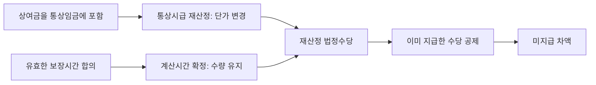
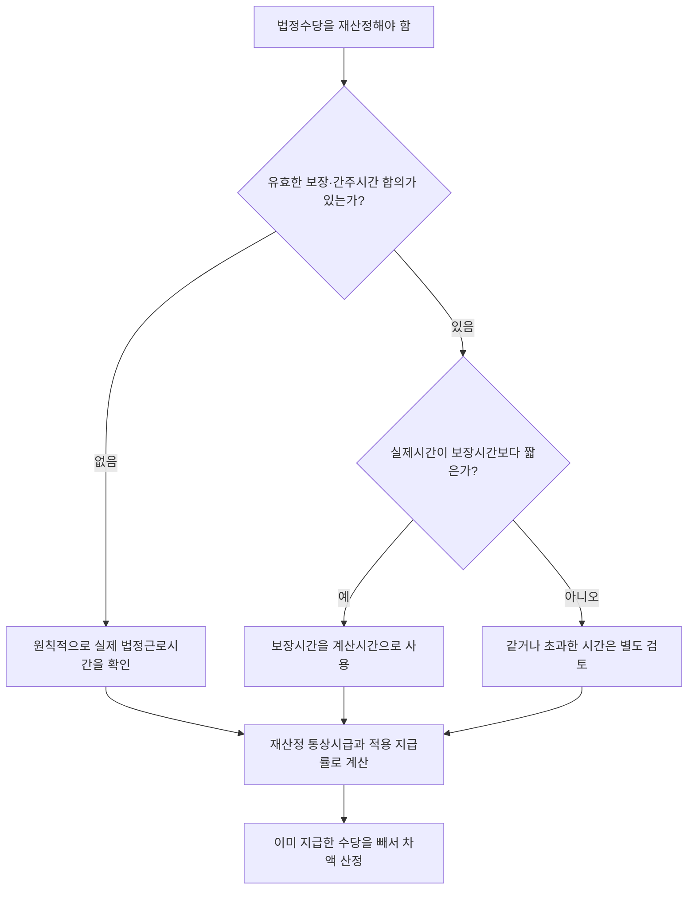

# 보장시간 합의 후 법정수당 재산정

> **한 문장으로:** 상여금을 통상임금에 새로 포함하면 법정수당의 **시간당 단가**는 올라간다. 그러나 노사가 유효하게 정한 **보장시간**까지 실제시간으로 줄어드는 것은 아니다. 따라서 실제시간이 보장시간보다 짧아도, 미지급 수당은 원칙적으로 **재산정한 통상시급 × 보장시간**을 기초로 계산한다.

## 이 문서가 다루는 질문

법정수당은 크게 **단가 × 시간 × 지급률**로 계산한다.

`법정수당 = 통상시급(단가) × 계산에 넣을 시간(수량) × 적용 지급률`

이 사건에서는 두 가지가 순서대로 문제 되었다.

1. 상여금을 통상임금에 포함하면 **통상시급이 얼마로 올라가는가?**
2. 올라간 통상시급에 **실제시간과 보장시간 중 어느 시간을 곱하는가?**

이 문서의 핵심은 두 번째 질문이다. 대법원은 유효한 보장시간 합의가 있고 실제시간이 그보다 짧다면, **보장시간을 곱해야 한다**고 판단하였다.

## 먼저 알아둘 말

| 용어 | 이 문서에서의 뜻 |
|---|---|
| 통상시급 | 연장·야간·휴일근로수당을 계산할 때 사용하는 1시간당 기준임금 |
| 실제시간 | 근로자가 현실에서 연장·야간·휴일에 근로한 시간 |
| 보장시간 또는 간주시간 | 실제시간이 매번 달라도 수당 계산에서는 일정 시간을 인정하기로 노사가 미리 정한 시간 |
| 법정수당 재산정 | 빠져 있던 상여금 등을 통상임금에 포함해 통상시급과 그에 따른 수당을 다시 계산하는 것 |
| 미지급 차액 | 재산정한 수당에서 사용자가 이미 지급한 수당을 뺀 금액 |

여기서 말하는 보장·간주시간 합의는 **수당 계산에 사용할 시간을 정한 노사합의**를 가리킨다. 근로기준법 제58조의 사업장 밖 간주근로시간제와 언제나 같은 제도라는 뜻은 아니다.

## 실제 사건의 구조

버스 운전기사들은 2012년 6월부터 2015년 6월까지 단체협약과 임금협정에 따라 임금을 받았다. 회사는 월간 실제 근로시간이 약정한 시간에 미달해도 아래 시간을 기준으로 수당을 지급하였다.

| 근무 유형 | 노사가 정한 계산시간 | 회사의 지급 방식 |
|---|---:|---|
| 주간근무일 | 소정근로 8시간 + 연장근로 1시간 | 실제 연장근로가 짧아도 1시간분 연장근로수당 지급 |
| 격주의 연장근무일 | 연장근로 5시간 | 실제 연장근로가 짧아도 5시간분 시프트 근로수당 지급 |
| 오전 근무 | 야간근로 2시간 | 2시간을 야간근로로 간주하여 수당 지급 |
| 오후 근무 | 야간근로 3시간 | 3시간을 야간근로로 간주하여 수당 지급 |

주간근무일과 연장근무일의 부족·초과 시간은 일별로 바로 정산하지 않고 월 단위로 상계하기로 하였다. 그럼에도 월간 실제시간이 보장시간보다 짧을 때 회사가 보장시간분 수당을 지급해 온 점이, 일정 시간을 보장·간주하기로 한 합의의 존재를 뒷받침하였다.

그 뒤 상여금이 통상임금에 포함되어야 한다는 판단에 따라 통상시급을 다시 계산하게 되었다. 이때 원심은 실제시간이 보장시간보다 짧은 경우 **실제시간**만으로 추가 수당을 계산했지만, 대법원은 이 부분을 파기·환송하였다.

## 무엇이 바뀌고, 무엇이 그대로인가

| 계산 요소 | 재산정 전후의 처리 |
|---|---|
| 통상시급인 **단가** | 상여금을 포함해 다시 계산하므로 올라갈 수 있음 |
| 보장시간인 **수량** | 유효한 합의가 유지되는 한 실제시간으로 축소하지 않음 |
| 법정·약정 **지급률** | 해당 수당의 법정 기준과 약정에 따라 적용 |
| 이미 지급한 금액 | 최종 재산정액에서 공제하여 미지급 차액만 산출 |

쉽게 말하면, **가격표를 고쳤다고 주문 수량까지 바뀌는 것은 아니다.** 통상임금 재산정은 시간당 가격을 고치는 작업이고, 보장시간 합의는 계산에 넣을 시간 수를 정하는 약정이다.

## 숫자로 보는 예시

다음은 판결의 실제 액수가 아니라 계산 원리를 보여 주기 위한 가정이다.

- 종전 통상시급: 10,000원
- 상여금을 포함한 재산정 통상시급: 12,000원
- 통상시급 차액: 2,000원
- 실제 연장근로: 3시간
- 합의한 보장 연장근로: 5시간
- 설명을 위한 지급률: 150%

보장시간을 적용한 추가 수당은 다음과 같다.

`(12,000원 - 10,000원) × 5시간 × 150% = 15,000원`

반면 실제시간 3시간만 적용하면 다음과 같이 줄어든다.

`(12,000원 - 10,000원) × 3시간 × 150% = 9,000원`

대법원이 잘못이라고 본 것은 두 번째 방식이다. 회사가 처음 수당을 지급할 때는 5시간을 보장해 놓고, 통상시급이 올라 추가 차액을 계산할 때만 실제 3시간을 주장할 수는 없다는 취지이다.

실제 사건의 정산에서는 수당의 구성과 이미 지급한 금액을 확인해야 한다. 연장근로의 임금 전체를 계산하면 통상임금 100%와 가산분 50%를 합한 150%가 문제 될 수 있지만, 기본 100%가 이미 지급되어 **가산분만** 계산하는 구조라면 50%만 따로 적용할 수 있다. 야간근로와 연장근로가 겹치는 경우에도 각 가산분과 기지급액을 구분하여 중복 공제를 피해야 한다.

## 판단 순서

실무에서는 다음 순서로 자료를 맞춰 보면 된다.

1. 단체협약, 임금협정, 취업규칙과 실제 지급 관행에서 보장시간 합의가 확인되는지 본다.
2. 연장·야간·휴일근로별 보장시간을 각각 특정한다.
3. 통상임금에 새로 포함될 임금항목과 재산정 통상시급을 확정한다.
4. 실제시간이 보장시간에 미달하면 보장시간을 적용한다.
5. 해당 기간의 법정·약정 지급률을 적용하고, 이미 지급한 금액을 뺀다.

## 이 판결을 적용할 때 주의할 점

- **보장시간 합의가 실제로 있어야 한다.** 단순히 매월 정액수당을 지급했다는 사정만으로 언제나 특정 시간이 보장되었다고 단정할 수는 없다. 협약 문언, 임금명세, 산식과 지급 관행을 함께 본다.
- **실제시간이 보장시간에 미달한 경우가 직접 쟁점이다.** 실제시간이 보장시간을 초과하면 초과분과 근로기준법상 최저기준을 별도로 계산해야 한다.
- **통상시급과 시간 수는 별개의 요소다.** 상여금의 통상임금 해당 여부가 확정되었다고 해서 보장시간의 유효성까지 자동으로 확정되는 것은 아니며, 그 반대도 마찬가지다.
- **판결이 정확한 최종 금액을 확정한 것은 아니다.** 대법원은 실제시간을 사용한 원심 계산이 잘못되었다고 보아 미지급 연장·야간근로수당 부분을 파기·환송하였다.
- **사건에는 구 근로기준법 제56조가 적용되었다.** 임금 발생 기간이 2012년 6월부터 2015년 6월까지였기 때문이다. 다른 기간의 사건은 그 기간에 시행된 법률, 가산율과 중복가산 구조를 다시 확인해야 한다.

## 결론

이 사실유형의 핵심은 **단가와 시간 수를 분리하는 것**이다. 상여금을 반영해 통상시급을 올려 잡았다면 그 새 단가를 사용하되, 실제시간과 관계없이 일정 시간을 보장·간주하기로 한 유효한 합의가 있다면 그 시간 수는 그대로 적용한다. 실제시간이 더 짧다는 이유만으로 재산정 단계에서 보장시간을 줄일 수 없다.

## 관련 문서

- [[보장근로시간 합의에 따른 법정수당 재산정 규칙]]
- [[대법원 2026. 4. 30. 선고 2025다219757·219758 판결]]
- [[통상임금]]
- [[근로기준법 제56조 연장 야간 및 휴일 근로]]
- [[근로기준법 시행령 제6조 통상임금]]

