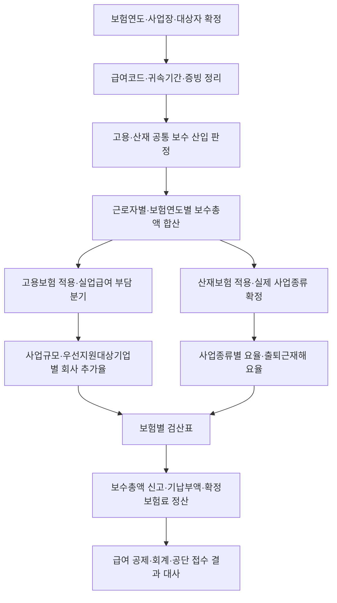

# 고용·산재보험 보수총액·확정보험료 정산 가이드

> **적용 기준**
> 2026-07-26 현재 일반적으로 적용되는 사업의 고용보험·산재보험 보수총액, 보험 연도 신고와 확정보험료 정산을 위한 중심 문서다. 실제 신고 기한·서식·접수 결과와 사업 종류 결정은 근로복지공단의 최신 자료와 사업장별 보험관계 통지를 우선한다.

## 이 가이드의 역할

고용보험과 산재보험은 같은 보수 자료를 출발점으로 사용할 수 있지만, 보험료율·부담 주체·사업 분류는 같지 않다. 이 문서는 `급여 항목 → 보수총액 → 고용보험 분기 → 산재보험 분기 → 신고·확정보험료 정산` 순서를 고정해, 단일 “고용산재보험료” 칸에 서로 다른 결론을 섞지 않게 한다.

적용 제외, 건설공사 일괄 적용, 개별 실적 요율·산재 예방 요율, 65세 이후 신규 고용 등 특례는 결론을 바꿀 수 있다. 이 Guide의 기본 산식만으로 확정하지 말고, 적용 대상·보험관계·사업 종류에 관한 별도 Rule과 공단 통지를 추가로 확인한다.

## 질문별 바로가기

| 지금 가진 질문 | 먼저 볼 문서 | 이 Guide에서 이어서 할 일 |
|:---|:---|:---|
| 이 급여가 고용·산재 보수인가 | [[고용·산재보험 보수총액 산입 규칙]] | 보험연도·대상자별 보수총액으로 집계 |
| 비과세나 실비를 어떻게 뺄 것인가 | [[근로소득 과세·비과세 판정 규칙]] | 근로소득 출발값과 법령상 제외 근거를 대사 |
| 근로자 급여에서 무엇을 공제하는가 | [[고용산재보험료징수법 제2조·제13조·제14조]] | 실업급여 근로자 부담과 회사 부담을 분리 |
| 회사가 추가로 부담할 고용보험료는 무엇인가 | [[고용산재보험료징수법 시행령 제12조·제13조]] | 상시근로자 수·우선지원대상기업 여부로 추가율 확인 |
| 산재보험료율을 어떻게 찾는가 | [[2026년도 사업종류별 산재보험료율 고시]] | 실제 주된 사업과 사업종류별 요율·출퇴근재해 요율 확인 |
| 보험연도 말에 무엇을 신고·정산하는가 | [[근로복지공단 2026 보수총액 신고 안내]] | 신고 보수총액·기납부액·확정보험료·차액 대사 |

## 한눈에 보는 판단 흐름



## 1단계: 먼저 공통 보수총액을 확정한다

고용·산재보험의 보수는 소득세법상 근로소득에서 보험료 징수 법령이 정한 제외 금품과 특례를 조정한 금액이다. 따라서 근로기준법상 임금, 건강보험 보수월액, 단순 급여 총액을 그대로 사용하지 않는다. ^guide-eiwci-common-base

실무상 다음 값을 분리한다.

1. 급여대장의 총 지급액
2. 소득세법상 근로소득과 적법한 비과세 근로소득
3. 고용·산재보험의 월별 보수
4. 보험연도 근로자별 보수총액

[[고용·산재보험 보수총액 산입 규칙]]의 순서대로 급여 코드의 지급 원인·대상 기간·지급일·귀속액을 확인하고, 실비 변상·비과세·휴직 특례를 조정한다. 입·퇴사·휴직·소급 지급분은 지급일만 보지 말고 보험 연도의 귀속도 함께 기록한다.

### 기존 사실유형은 산입 판단의 출발점이다

| 지급구조 | 산입 판단용 문서 | 보수총액 단계에서 남길 기록 |
|:---|:---|:---|
| 기본급·고정수당 | [[정액 기본급 지급]] | 대상자별 월 귀속액 |
| 정기상여 | [[정기상여금 지급구조]] | 지급대상기간과 보험연도 귀속 |
| 개인·팀 성과급 | [[목표달성도 연동 인센티브]] | 근로소득 여부·최소보장분·귀속 |
| 기업 재무성과급 | [[재무지표 연동 경영성과급]] | 지급 의무와 소득 구분 |
| 현금 식대 | [[현금 식대 정액 지급]] | 비과세 한도·식사 제공 여부 |
| 자가운전보조금 | [[자가운전보조금 정액 지급]] | 업무 사용·실제 여비 중복 여부 |
| 자녀 보육급여 | [[자녀 보육급여 정액 지급]] | 자녀별 비과세 요건·한도 |
| 생산직 초과근로수당 | [[생산직 연장·야간·휴일수당]] | 대상자·누계 한도·과세 전환분 |
| 선택적 복지포인트 | [[사용제한형 선택적 복지포인트]] | 배정·사용·소멸과 근로소득 판단 |
| 증빙 여비 | [[증빙 기반 실비 여비 정산]] | 출장·영수증·비용 상환의 일치 |
| 연차수당 | [[연차유급휴가 및 미사용수당]] | 권리 확정·귀속·지급일 |
| 직무발명보상금 | [[재직 중·퇴직 후 직무발명보상금]] | 재직 여부·근로소득·자격기간 |

## 2단계: 같은 보수총액에서도 고용보험과 산재보험을 분기한다

실업급여 보험료는 총 1.8%를 원칙적으로 근로자와 사업주가 0.9%씩 나누어 부담한다. 사업주는 이에 더해 사업규모·우선지원대상기업 여부에 따른 고용안정·직업능력개발사업 보험료를 부담한다. 산재보험료는 사업주가 부담하며 실제 사업종류별 요율과 출퇴근재해 요율을 별도로 적용한다. ^guide-eiwci-separate-burdens

| 계산열 | 산정 기초 | 2026년 확인값 | 부담주체 | 급여공제 여부 |
|:---|:---|:---|:---|:---|
| 실업급여 근로자 부담 | 적용 근로자의 보수 | 0.9% | 근로자 | 공제 대상 |
| 실업급여 사업주 부담 | 적용 근로자의 보수 | 0.9% | 사업주 | 공제하지 않음 |
| 고용안정·직업능력개발사업 | 적용 근로자의 보수 | 0.25% / 0.45% / 0.65% / 0.85% 중 해당값 | 사업주 | 공제하지 않음 |
| 산재보험 | 적용 근로자의 보수 | 사업종류별 요율 + 출퇴근재해 0.6/1,000 | 사업주 | 공제하지 않음 |

```text
근로자 실업급여 부담 검산값 = 보수 × 0.9%
사업주 실업급여 부담 검산값 = 보수 × 0.9%
사업주 고용안정·직업능력개발 부담 검산값 = 보수 × 해당 추가율
산재보험료 검산값 = 보수 × (해당 사업종류별 요율 + 출퇴근재해 요율)
```

산재보험 평균요율이나 다른 사업장의 업종을 대입하지 않는다. 사업 종류별 고시 요율은 실제 주된 사업·최종 생산물 또는 서비스·공정·근로자 배치를 근거로 찾으며, 사업자등록의 업태·종목만으로 결론을 내리지 않는다. ^guide-eiwci-industrial-branch

## 3단계: 결론을 바꾸는 사업장 조건을 별도 통제한다

보수총액이 같아도 다음 사실이 바뀌면 보험료 결론이 달라질 수 있다. 변경일에 곧바로 새 값으로 덮어쓰지 말고, 해당 보험연도의 특례와 공단 통지를 함께 보관한다. ^guide-eiwci-change-conditions

| 변경조건 | 무엇이 달라지는가 | 먼저 확인할 자료 | 흔한 오류 |
|:---|:---|:---|:---|
| 상시근로자 수 | 사업주 추가 고용보험료율 | 국내 전체 사업의 상시근로자 수, 예외 적용 여부 | 사업장관리번호별 인원만으로 판단 |
| 우선지원대상기업 여부 | 150명 이상 구간의 추가율 | 해당 보험연도 기업 요건·판정 자료 | 인원수만 보고 0.45% 또는 0.65% 확정 |
| 조직변경·인원 증가 | 적용시점·경과 특례 | 양도·합병·기업집단·인원변동 및 보험연도 자료 | 증가한 달에 자동으로 높은 요율 적용 |
| 산재보험 사업종류 | 사업종류별 요율 | 주된 사업, 공정, 매출·인력 구성, 사업종류 예시표 | 평균요율 또는 유사 업종 요율 사용 |
| 복수 사업·보험관계 변동 | 보수·요율의 적용단위 | 사업장관리번호, 장소, 보험관계 성립·소멸 통지 | 한 사업의 요율을 모든 장소에 복사 |

## 4단계: 보수총액 신고와 확정보험료 정산을 재현 가능하게 만든다

보험 연도 종료 후에는 근로자별 실제 보수총액을 신고하고, 그 금액을 기초로 계산한 확정보험료와 이미 납부한 보험료를 비교한다. 차이는 추가 납부, 충당 또는 반환으로 이어질 수 있으므로 보수총액·요율·기납부액을 하나의 차이로 묶어 처리하지 않는다. ^guide-eiwci-report-settlement

| 대사 필드 | 대사 대상 | 차이의 대표 원인 |
|:---|:---|:---|
| `EI_WCI_REMUNERATION` | 급여대장·원천세의 근로소득에서 조정한 보수 | 비과세 요건·실비증빙·귀속연도 오류 |
| `EI_UNEMPLOYMENT_EMPLOYEE` | 근로자 급여공제액 | 적용제외·반올림·정정분 누락 |
| `EI_UNEMPLOYMENT_EMPLOYER` | 회사 실업급여 부담 | 근로자 공제만 남기고 회사 비용 누락 |
| `EI_STABILIZATION_EMPLOYER` | 사업주 추가 고용보험료 | 인원·우선지원대상기업·경과특례 오류 |
| `WCI_EMPLOYER` | 산재보험 회사 부담 | 사업종류·출퇴근재해·특례요율 오류 |
| `EI_WCI_FINAL_SETTLEMENT` | 확정보험료와 기납부액 차이 | 보수누락, 요율 변경, 신고·고지시차 |

### 정산 전 점검 순서

1. 보험연도, 사업장관리번호, 보험관계 성립·소멸일과 대상자를 확정한다.
2. 근로자별 월 보수를 합산하고 급여대장·원천세 누계와 차이를 급여코드별로 설명한다.
3. 고용보험의 근로자 부담·사업주 실업급여 부담·사업주 추가 부담을 세 열로 계산한다.
4. 산재보험은 실제 사업종류별 요율과 출퇴근재해 요율을 별도로 계산한다.
5. 신고 보수총액, 기납부 보험료, 확정보험료와 차액의 발생 원인을 대사한다.
6. 전자신고 접수 결과, 오류 내역, 정정·환급·충당 자료를 함께 보관한다.

## 흔한 오류와 교정

| 오류 | 왜 위험한가 | 교정 |
|:---|:---|:---|
| 급여총액에 단일 보험료율을 곱함 | 보수 산입과 보험별 분기를 모두 놓침 | 보수총액 확정 뒤 고용·산재 계산열을 분리 |
| 산재보험료를 급여에서 공제 | 산재보험은 사업주 부담 구조와 맞지 않음 | `WCI_EMPLOYER`로 회사 비용만 관리 |
| 실업급여 0.9%만 회사 보험료로 기록 | 사업주 추가 고용보험료가 누락됨 | 고용안정·직업능력개발사업 추가율을 별도 적용 |
| 산재 평균요율을 적용 | 실제 사업종류별 위험률과 다름 | 해당 보험연도 고시·사업종류 예시표 확인 |
| 비과세 명칭만 보고 보수에서 제외 | 지급요건·한도 미충족분이 누락될 수 있음 | 근로소득과 비과세 요건부터 확정 |
| 신고 보수총액만 저장 | 기납부액·확정보험료·차액의 원인을 재현할 수 없음 | 신고·고지·급여·회계의 네 자료를 함께 보관 |

## 판정 기록 최소 양식

```text
보험연도 / 사업장관리번호 / 보험관계 상태:
대상 근로자와 자격·적용제외 확인:
급여코드별 근로소득·비과세·실비·보수 조정 근거:
근로자별 월 보수 및 보험연도 보수총액:
상시근로자 수 / 우선지원대상기업 / 조직변경 특례:
산재보험 사업종류 / 근거 사실 / 출퇴근재해 요율:
고용보험: 근로자 실업급여 / 사업주 실업급여 / 사업주 추가 부담:
산재보험: 사업주 부담:
신고 보수총액 / 기납부액 / 확정보험료 / 정산차액:
접수 결과·정정·충당·환급 및 다음 재검토 트리거:
```

## 검토 한계와 변경 감시

- [[근로복지공단 2026 보수총액 신고 안내]]는 `review` 상태의 행정 안내다. 실제 신고기한·서식·화면·접수 오류는 제출 직전에 공단 자료를 다시 확인한다.
- 2026년 산재보험료율 고시는 2026년 보험연도에 한정된다. 2027년 고시가 나오면 사업종류별 요율과 출퇴근재해 요율을 다시 적용한다.
- 사업규모·우선지원대상기업·산재보험 사업종류·보험관계가 바뀌면 보수총액은 공유하더라도 요율과 부담주체를 재판정한다.
