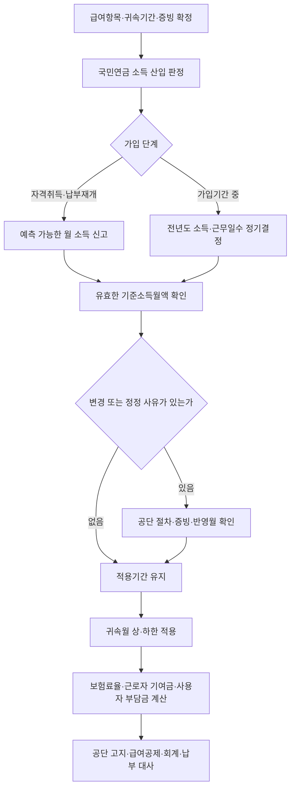

# 국민연금 기준소득월액·보험료 신고·정정·대사 가이드

> **적용 기준**
> 2026-07-26 현재 사업장가입자의 국민연금 소득 산입, 기준소득월액 결정, 보험료 계산과 대사를 위한 중심 문서다. 실제 신고·정정의 접수 가능 여부와 반영월은 공단 결정통지와 최신 신고 화면을 우선한다.

## 이 가이드의 역할

이 문서는 “이번 달 급여가 바뀌었는데 국민연금도 바로 바뀌는가”라는 질문을 `급여 항목 산입`과 `기준소득월액 결정·적용`으로 나누어 처리한다. 기준소득월액은 그달 급여 총액을 단순히 복사한 값이 아니라, 법정 소득 범위와 취득·정기 결정·변경·정정 절차를 거쳐 보험료와 장래 급여 계산에 쓰는 결정값이다. ^guide-nps-decided-base

지역가입자·임의가입자·임의계속가입자, 적용제외·납부예외, 체납·분할납부의 개별 요건은 이 Guide의 기본 범위 밖이다. 해당 사안은 가입자 유형과 공단 결정자료를 먼저 확정한 뒤 관련 법령·안내를 추가 확인한다.

## 질문별 바로가기

| 지금 가진 질문 | 먼저 볼 문서 | 이 Guide에서 이어서 할 일 |
|:---|:---|:---|
| 이 상여·수당·복지급여가 국민연금 소득인가 | [[국민연금 기준소득월액 산입 규칙]] | 산입액을 취득·정기결정·변경·정정 중 어느 단계에 넣을지 확정 |
| 비과세 식대·차량보조·여비를 어떻게 처리하는가 | [[근로소득 과세·비과세 판정 규칙]] | 비과세의 적법한 범위와 시행령상 재산입 예외를 확인 |
| 기준소득월액과 이번 달 급여가 왜 다른가 | [[국민연금 기준소득월액]] | 적용 중인 결정값·적용기간·상·하한을 대사 |
| 취득·복직 시 무엇을 신고하는가 | [[국민연금공단 2026 사업장 업무가이드]] | 예측 가능한 근로소득과 미확정 변동급을 분리 |
| 2026년 상·하한과 보험료를 검산하려는가 | [[2026년 국민연금 보험료율·기준소득월액 규칙]] | 귀속월별 상·하한, 총 9.5%, 노사 각 4.75% 적용 |
| 과거 신고가 틀렸거나 고지가 달라졌는가 | [[국민연금법 제3조·제88조 및 2026년 보험료 특례]] | 변경인지 정정인지 구별하고 원 귀속월별로 재대사 |

## 한눈에 보는 생애주기



## 1단계: 급여 항목 산입과 결정 단계를 분리한다

먼저 급여 코드별 지급 원인, 대상 기간, 지급일, 근로소득 해당 여부와 비과세 근거를 기록한다. 그다음 [[국민연금 기준소득월액 산입 규칙]]에 따라 `근로소득 − 적법한 비과세 근로소득 + 시행령상 재산입 예외`의 순서를 적용한다. 노동법상 임금성이나 다른 사회보험의 보수 결론을 그대로 적용하지 않는다.

산입 결론만으로 당월 보험료가 정해지지 않는다. 정해진 국민연금 소득을 취득 시 예상소득, 가입 기간 중 정기결정의 전년도 소득, 유효한 변경·정정 결과 중 어느 경로로 기준소득월액에 연결할지 별도로 적는다.

### 기존 사실유형은 링크로만 사용한다

아래 표는 항목별 결론을 이 문서에 복제하지 않는다. 각 사실유형에서 지급원인·비과세 요건·실비 증빙을 확정한 뒤 이 Guide의 생애 주기로 돌아온다.

| 지급구조 | 산입 판단용 문서 | 기준소득월액 단계에서 추가 기록할 사실 |
|:---|:---|:---|
| 기본급·고정수당 | [[정액 기본급 지급]] | 취득 시 월액과 전년도 귀속액 |
| 정기상여 | [[정기상여금 지급구조]] | 지급대상기간, 취득 시 예측 가능성 |
| 개인·팀 성과급 | [[목표달성도 연동 인센티브]] | 최소보장분·변동분, 전년도 귀속 |
| 기업 재무성과급 | [[재무지표 연동 경영성과급]] | 근로소득 해당 여부와 확정시점 |
| 현금 식대 | [[현금 식대 정액 지급]] | 비과세 한도와 요건 충족 여부 |
| 자가운전보조금 | [[자가운전보조금 정액 지급]] | 직접 운전·업무 사용·실제 여비 중복 여부 |
| 자녀 보육급여 | [[자녀 보육급여 정액 지급]] | 자녀별 한도·대상기간 |
| 생산직 초과근로수당 | [[생산직 연장·야간·휴일수당]] | 비과세 대상·한도와 귀속연도 |
| 선택적 복지포인트 | [[사용제한형 선택적 복지포인트]] | 배정·사용·소멸 중 어느 금액이 근로소득인지 |
| 증빙 여비 | [[증빙 기반 실비 여비 정산]] | 출장·영수증·정산액의 일치 |
| 연차수당 | [[연차유급휴가 및 미사용수당]] | 권리 확정·지급·귀속 시점 |
| 직무발명보상금 | [[재직 중·퇴직 후 직무발명보상금]] | 재직 여부와 소득구분 |

## 2단계: 취득·정기결정·변경·정정을 같은 신고로 취급하지 않는다

자격 취득 또는 납부 재개 때에는 사용자가 지급하기로 약정했고 지급을 예측할 수 있는 근로소득을 월액으로 환산한다. 가입 기간 중 정기 결정은 전년도 해당 사업장에서 얻은 소득 총액과 근무 일수를 기준으로 하며, 통상 그 결과가 7월부터 다음 해 6월까지 적용된다. ^guide-nps-acquisition-regular

따라서 월별 실제 급여 변동은 기준소득월액 자동변경 신호가 아니다. 급여인상·일시상여·수당 신설을 발견하면 먼저 현재 공단 결정액과 적용기간을 확인하고, 공단 업무기준상 변경신고 대상인지, 기존 취득·소득자료의 오류를 바로잡는 정정인지 구분한다. ^guide-nps-monthly-pay-boundary

| 구분 | 출발 사실 | 핵심 입력 | 처리 목적 | 적용값 확인 방법 |
|:---|:---|:---|:---|:---|
| 자격취득·납부재개 | 입사·복직 | 예측 가능한 월 근로소득 | 최초 기준소득월액 결정 | 신고값과 공단 결정통지 대조 |
| 정기결정 | 가입기간 중 정례 산정 | 전년도 소득총액·근무일수 | 다음 적용기간의 기준값 갱신 | 전년도 급여·비과세·귀속자료와 대조 |
| 변경 | 소득 구조나 공단 업무 기준상 변경 사유 | 변경 사유·변경 후 소득 자료 | 유효 기준값의 장래 조정 | 접수·결정·적용월을 통지 자료로 확인 |
| 정정 | 취득신고·소득총액·결정자료의 오류 | 오류 전후 원자료·원 귀속월 | 과거 결정·고지 재산정 | 추가·환급 고지와 노사 부담분을 분리 대사 |
| 단순 월 급여 변동 | 일시 상여·근무시간·수당 변동 등 | 해당 월 급여대장 | 자동 변경 근거가 아님 | 변경·정정 대상인지 별도 판정 |

## 3단계: 2026년의 두 시간축을 분리한다

2026년 사업장가입자의 총 보험료율은 연중 9.5%이고 근로자 기여금과 사용자 부담금은 각각 4.75%다. 반면 기준소득월액 상·하한은 7월을 경계로 달라진다. 제88조 본문의 최종 비율이나 이전의 9%를 2026년 급여에 그대로 쓰지 않는다. ^guide-nps-2026-version-values

| 보험료 귀속월 | 상·하한 적용구간 | 하한 | 상한 | 총 보험료율 | 근로자 기여금 | 사용자 부담금 |
|:---|:---|---:|---:|---:|---:|---:|
| 2026년 1월~6월 | 2025.7.~2026.6. | 400,000원 | 6,370,000원 | 9.5% | 4.75% | 4.75% |
| 2026년 7월~12월 | 2026.7.~2027.6. | 410,000원 | 6,590,000원 | 9.5% | 4.75% | 4.75% |

```text
적용 기준소득월액 = 결정된 기준소득월액에 귀속월의 하한·상한을 적용한 값
총 보험료 검산값 = 적용 기준소득월액 × 9.5%
근로자 기여금 검산값 = 적용 기준소득월액 × 4.75%
사용자 부담금 검산값 = 적용 기준소득월액 × 4.75%
```

원 단위 처리와 실제 고지액은 공단 결정·고지서 기준으로 확정한다. 2027년에는 경과 보험료율과 2027-07-01 상·하한을 별도 확인한 뒤 급여 시스템의 값과 이 표를 교체한다.

## 4단계: 고지·급여·회계를 가입자별로 대사한다

대사는 총액 한 줄이 아니라 가입자·귀속월·부담주체별로 한다. 국민연금공단의 기준소득월액 결정, 국민건강보험공단의 고지·수납, 사업장의 급여공제·회계가 모두 같은 값일 필요는 없지만, 차이는 결정·신고·반영시차 중 하나로 설명할 수 있어야 한다. ^guide-nps-burden-reconcile

| 대사 필드 | 확인할 값 | 불일치 때 먼저 찾을 원인 |
|:---|:---|:---|
| `NPS_INCLUDABLE_INCOME` | 산입된 근로소득과 제외·재산입 근거 | 급여코드·비과세 요건·귀속연도 오류 |
| `NPS_STANDARD_INCOME` | 공단의 유효 기준소득월액 | 취득·정기결정·변경·정정의 구분 오류 |
| `NPS_EMPLOYEE_CONTRIBUTION` | 급여에서 실제 공제한 4.75% 상당액 | 반영월·원 단위·정정분 누락 |
| `NPS_EMPLOYER_BURDEN` | 회사 부담 4.75% 상당액 | 근로자 부담과 혼합된 회계계정 |
| `NPS_NOTICE_TOTAL` | 고지서 총액·추가 또는 환급 고지 | 상·하한·고지시차·원 귀속월 재산정 |
| `NPS_PAYMENT` | 실제 납부·상계·환급액 | 고지월과 납부월 또는 예수금 차이 |

### 짧은 대사 예시

2026년 8월 공단 결정 기준소득월액이 4,000,000원인 사업장가입자는 총 380,000원, 근로자 공제 190,000원, 사용자 부담 190,000원의 검산값을 가진다. 같은 달 실제 급여가 4,300,000원으로 변했더라도 유효한 공단 결정액이 4,000,000원이라면 우선 그 결정액을 사용하고, 변경·정정 대상 여부를 별도로 기록한다.

## 흔한 오류와 교정

| 오류 | 왜 위험한가 | 교정 |
|:---|:---|:---|
| 월 실제급여 × 9.5%를 곧바로 공제 | 기준소득월액 결정·상·하한·적용기간을 빠뜨림 | 공단 결정액 → 귀속월 상·하한 → 요율 순서로 계산 |
| 비과세 코드면 무조건 제외 | 한도·대상자·국민연금 재산입 예외를 놓침 | 세법 요건과 시행령 제3조를 모두 확인 |
| 임금인 항목은 모두 취득월에 넣음 | 취득 시 예측 가능성과 미확정 변동급을 혼동 | 약정·산식·확정시점을 분리 기록 |
| 급여가 바뀌면 시스템 기준값을 즉시 수정 | 변경과 정정, 공단 반영시점을 혼동 | 현재 결정액과 신고 사유를 먼저 확인 |
| 추가고지를 다음 달 급여에만 반영 | 과거 귀속월과 노사 부담분이 사라짐 | 원 귀속월별 기여금·부담금·고지를 분리 대사 |

## 판정 기록 최소 양식

```text
가입자 / 사업장관리번호 / 보험료 귀속월:
검토 목적: 취득 / 정기결정 / 변경 / 정정 / 고지대사
급여항목별 산입·제외 근거:
전년도 소득총액·근무일수 또는 취득 시 예상소득:
공단 결정 기준소득월액 / 적용기간:
적용 상·하한 / 2026 보험료율:
근로자 기여금 / 사용자 부담금 / 고지 총액:
추가·환급 고지와 원 귀속월:
급여공제·회계·납부 대사 결과:
다음 재검토 트리거:
```

## 검토 한계와 변경 감시

- 2026년 수치는 이 Guide의 기준일에 한정되며, 2027년 보험료율 경과구간과 새 상·하한을 재검토한다.
- 사업장가입자 여부, 자격취득·상실·납부예외와 실제 신고 가능 여부는 공단의 최신 결정·접수자료를 우선한다.
- 법령상 소득 범위를 바꾸는 판단은 법률·시행령을 우선하고, 공단 안내는 신고·대사 절차를 보완하는 자료로 사용한다.
