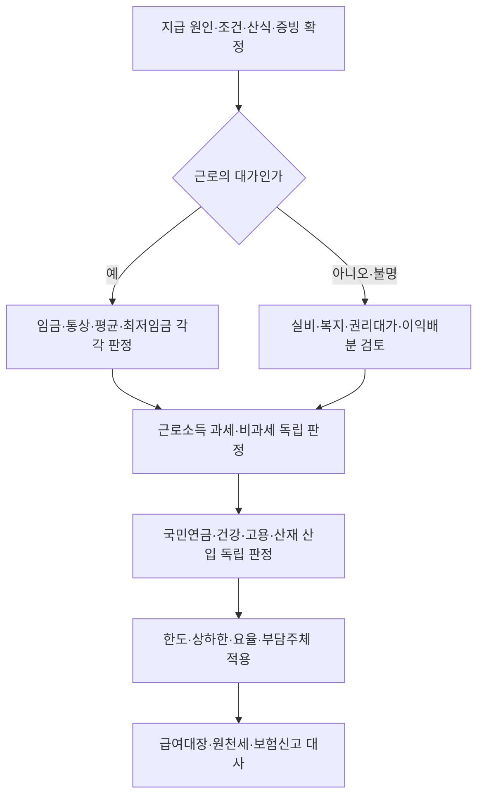

# 급여항목 법적 분류 실무 가이드

> **사용 기준일과 문서 상태**
> 이 가이드는 2026-07-25 현재 법령·공식 요율과 연결되어 있으며 `review` 상태다. 실제 신고·정산·분쟁 대응 전에는 지급일의 시행법령과 연결된 Rule의 검증일을 다시 확인한다.

## 사용 범위

이 문서는 하나의 급여코드를 다음 아홉 영역으로 나누어 판정할 때 쓰는 허브다.

1. 근로기준법상 임금
2. 통상임금
3. 평균임금
4. 최저임금 산입
5. 근로소득 과세·비과세
6. 국민연금 기준소득월액
7. 건강보험 보수월액과 장기요양보험
8. 고용보험 보수
9. 산재보험 보수

같은 금품도 영역별 결론이 다를 수 있다. 예를 들어 사용제한형 복지포인트나 기업 재무성과급은 노동법상 임금성이 부정되더라도 세법상 경제적 이익 또는 사회보험 보수 여부를 다시 판단해야 한다. ^guide-process

## 아홉 영역이 갈라진 이유

급여대장에서는 하나의 금액이지만 각 제도는 서로 다른 위험과 정책 목적을 다룬다. 근로기준법상 임금은 사용자가 지급해야 할 근로의 대가와 임금보호의 범위를 정한다. 통상임금은 소정근로의 가치를 표준화해 연장·야간·휴일수당 등 법정수당의 계산기준을 만들고, 평균임금은 일정 기간의 실제 임금 수준을 퇴직급여·재해보상 등에 반영한다. 최저임금은 생활보장의 최저선을 비교하기 위한 별도 산입범위를 둔다.

세법은 담세력과 정책적 지원을 기준으로 근로소득과 비과세를 나눈다. 사회보험은 각 급여의 재원이 되는 산정기초를 표준화하되 국민연금은 장래 연금급여, 건강·장기요양은 현행 의료·요양 재정, 고용보험은 실업·고용안정 위험, 산재보험은 사업종류별 재해위험을 중심으로 설계되었다. 따라서 “임금이다/아니다”라는 노동법 결론은 다른 제도의 출발자료일 수는 있어도 최종답은 아니다. ^guide-nine-axes

| 분류축 | 핵심 목적 | 실무상 먼저 묻는 질문 | 역사·개념 연결 |
|---|---|---|---|
| 임금 | 근로대가와 임금보호 | 사용자에게 지급의무가 있고 근로의 대가인가 | [[임금]], [[근로기준법상 임금 개념의 기원과 연혁]] |
| 통상임금 | 법정수당의 표준단가 | 소정근로의 대가로 정기·일률 지급하기로 했는가 | [[통상임금]], [[통상임금 고정성 법리 변경 연혁]] |
| 평균임금 | 실제 생활임금 수준 반영 | 산정사유 전 3개월에 귀속되는 임금인가 | [[평균임금]] |
| 최저임금 | 임금의 최저선 보장 | 비교대상 임금과 환산시간은 무엇인가 | [[2026년 적용 최저임금 규칙]] |
| 근로소득 | 담세력과 정책적 비과세 | 근로소득인가, 항목별 비과세 요건·한도를 충족하는가 | [[근로소득]], [[근로소득 비과세 급여의 형성과 한도 변천]] |
| 국민연금 | 보험료와 장래 급여의 기준 | 소득 산입 후 어느 상·하한과 보험료율을 쓰는가 | [[국민연금 기준소득월액]], [[국민연금 기준소득월액·보험료율 제도의 연혁]] |
| 건강·장기요양 | 의료·요양 보험재정 | 보수월액을 어떻게 정하고 장기요양보험료를 어떻게 연동하는가 | [[건강보험 보수월액]], [[직장건강보험 보수월액과 장기요양보험료 연동의 연혁]] |
| 고용보험 | 실업·고용안정 위험 | 보수총액과 보험사업별 부담을 어떻게 나누는가 | [[고용·산재보험 보수총액]] |
| 산재보험 | 사업별 재해위험 분담 | 보수총액과 실제 사업종류별 요율은 무엇인가 | [[고용·산재보험 보수 기준과 통합징수의 연혁]] |



## 가장 빠른 사용 순서

1. 아래 표에서 지급구조가 가장 가까운 사실유형을 연다.
2. 명칭을 지우고 지급 원인·대상·조건·산식·시점·증빙을 한 문장씩 적는다.
3. [[근로기준법상 임금성 판단 규칙]]으로 임금성을 먼저 판단한다.
4. 임금성이 인정되면 통상임금·평균임금·최저임금 Rule을 각각 적용한다.
5. [[근로소득 과세·비과세 판정 규칙]]으로 세법을 독립 판정한다.
6. 국민연금·건강보험·고용·산재보험의 보수 Rule을 각각 적용한다.
7. 귀속월의 요율과 상·하한을 적용한다.
8. 반대 결론을 만들 수 있는 조건과 누락 증빙을 기록한다.
9. 계산서·급여대장·신고자료를 대사한다.
10. 결론·근거·검토자·재검토 트리거를 판정기록에 남긴다.

## 전문 판단 Guide

이 문서는 급여항목을 아홉 법적 축으로 나누는 출발점이다. 아래 쟁점은 일반 표를 반복하지 않고 전문 Guide에서 판단·계산·신고 대사를 이어간다.

| 쟁점 | 전문 Guide | 이 Guide에서 넘겨야 할 입력값 |
|---|---|---|
| 포괄임금·고정OT | [[포괄임금·고정OT 판단·정산 실무 가이드]] | 계약 문언, 수당별 산식, 실근로시간, 기지급액 |
| 상여금·성과급 | [[상여금·성과급의 통상임금·평균임금 및 법정수당 재산정 가이드]] | 지급규정, 조건, 최소보장분, 대상기간·평가자료 |
| 평균임금·퇴직금 | [[평균임금·퇴직금 산입 판단 실무 가이드]] | 산정사유일, 3개월 근태, 제외기간, 귀속·확정·지급일 |
| 국민연금 | [[국민연금 기준소득월액·보험료 신고·정정·대사 가이드]] | 산입 항목, 자격취득·정기결정·변경·정정 이력 |
| 건강·장기요양 | [[직장건강보험 보수·보험료 판단 실무 가이드]] | 보수총액·보수월액, 신고 유형, 해당 연도 요율 |
| 고용·산재 | [[고용·산재보험 보수총액·확정보험료 정산 가이드]] | 보험연도, 보수총액, 고용보험 부담 구성, 사업종류 |

## 10단계 판정 절차

### 1. 급여코드의 실질 확정

급여대장 명칭보다 근로계약, 취업규칙, 단체협약, 지급규정, 실제 관행을 우선한다. 현금·포인트·현물·비용상환 여부와 근로자가 자유롭게 처분할 수 있는 시점을 적는다.

### 2. 지급의무와 조건 확정

사용자 재량, 지급일 재직조건, 근무일수·성과조건, 최소보장분, 퇴직자 일할계산을 확인한다.

### 3. 임금성 판정

근로의 대상으로 지급되는지, 사용자에게 법적 지급의무가 있는지 판단한다. 실제 업무비용 변상, 복리후생, 권리 이전 대가, 순수 기업성과 배분은 별도 검토한다.

### 4. 통상임금 판정

임금성이 인정된 금품만 대상으로 소정근로 대가성, 정기성, 일률성과 조건 구조를 적용한다. 명목상 고정성만으로 배제하지 않는다.

### 5. 평균임금 판정

임금성이 인정된 금품의 발생·귀속기간과 산정사유 발생 전 3개월 지급액을 확정한다. 분기·연간 성과급은 귀속 방식과 Rule을 확인한다.

### 6. 최저임금 판정

비교대상 임금, 산입 제외 항목, 소정근로시간과 월 환산 단위를 맞춘다. 법정 가산수당과 실제 비용상환을 섞지 않는다.

### 7. 근로소득세 판정

근로소득 과세가 원칙이다. 비과세는 항목별 대상자·지급방식·월 또는 연 한도를 모두 충족한 부분만 적용한다.

### 8. 사회보험 판정

네 보험을 하나의 “4대보험” 결론으로 묶지 않는다. [[국민연금 기준소득월액 산입 규칙]], [[건강·장기요양보험 보수월액 산입 규칙]], [[고용·산재보험 보수총액 산입 규칙]]을 차례로 적용한다.

### 9. 계산과 대사

과세·비과세 분할, 기준소득월액 상·하한, 보수월액, 보수총액, 귀속월과 부담 주체를 확정하고 급여대장·원천세·사회보험 신고자료를 서로 대사한다.

### 10. 판정기록과 재검토

결론만 저장하지 말고 사실, 적용 Rule, 법령 버전, 반대 사정, 누락 증빙, 검토일과 재검토 사유를 함께 저장한다.

## 12개 사실유형 바로가기

| 지급구조 | 노동법 출발점 | 세무·보험 출발점 | 결론을 바꾸는 핵심 사실 |
|---|---|---|---|
| [[정액 기본급 지급]] | 임금·통상·평균임금 포함 | 과세·사회보험 산입 | 법정수당 혼입 여부 |
| [[정기상여금 지급구조]] | 임금, 통상임금은 조건부 | 과세·사회보험 산입 | 재직·근무일수 조건, 일할계산 |
| [[목표달성도 연동 인센티브]] | 근로성과 연동 시 임금 가능 | 일반적으로 과세·산입 | 개인·팀 지표, 최소보장분 |
| [[재무지표 연동 경영성과급]] | 임금성 부정 가능 | 세법·보험은 별도 판정 | EVA·영업이익 등 기업성과 중심성 |
| [[현금 식대 정액 지급]] | 정액 지급이면 임금 가능 | 요건 충족 월 20만원 이하 비과세 | 식사 제공·중복 여부 |
| [[자가운전보조금 정액 지급]] | 정액 수당과 실비를 구분 | 요건 충족 월 20만원 이하 비과세 | 소유·임차, 직접운전, 실제여비 |
| [[자녀 보육급여 정액 지급]] | 정기 지급이면 임금 가능 | 6세 이하 자녀별 월 20만원 이내 | 나이·자녀 수·배우자 중복 |
| [[생산직 연장·야간·휴일수당]] | 임금·평균임금 포함 | 요건 충족분 연 240만원 이하 비과세 | 직종·월정액급여·총급여 |
| [[사용제한형 선택적 복지포인트]] | 일반 구조는 임금 아님 | 과세·보험은 별도 판정 | 사용·양도·현금화 제한 |
| [[증빙 기반 실비 여비 정산]] | 임금 아님 | 실비변상 비과세·보험 제외 | 출장·영수증·실제 지출 일치 |
| [[연차유급휴가 및 미사용수당]] | 지급의무 확정분은 임금 | 과세·사회보험 산입 원칙 | 발생·사용촉진·사용자 귀책 |
| [[재직 중·퇴직 후 직무발명보상금]] | 지급 원인별 조건부 | 소득구분·연 700만원 한도 | 권리승계·재량·재직 여부 |

이 표는 탐색용 요약이며 개별 사실유형 문서와 Rule을 우선한다. ^guide-matrix

## 종단 수치 사례 1: 정기 월 급여

### 사례 1 가상사실

- 기본급 3,200,000원
- 현금 식대 200,000원: 식사 미제공
- 자가운전보조금 200,000원: 본인 차량을 직접 업무에 사용하고 별도 실비여비를 받지 않음
- 보육급여 400,000원: 현행 요건을 충족하는 자녀 2명에게 각 200,000원
- 위 세 수당은 회사 규정상 정액 지급되고, 이 사례에서는 소정근로 대가성·정기성·일률성이 인정된다고 가정
- 연장근로 20시간

### 1단계: 노동법 계산

가정상 월 통상임금은 `3,200,000 + 200,000 + 200,000 + 400,000 = 4,000,000원`이다. 시간급은 `4,000,000 ÷ 209 = 19,138.76원`, 연장근로수당은 `19,138.76 × 1.5 × 20 = 574,163원`이다. 총 지급액은 `4,574,163원`이다.

| 영역 | 사례상 기록 | 다시 확인할 사항 |
|---|---|---|
| 임금 | 4,574,163원 | 차량비가 실제 실비정산이면 해당 부분 결론 변경 |
| 통상임금 | 월 4,000,000원 | 대상자 조건이 일률성을 충족하는지 |
| 평균임금 | 지급된 임금으로 산입 검토 | 산정사유 전 3개월 귀속액 |
| 최저임금 | 기본급·정기수당의 현행 산입범위로 비교 | 연장수당을 비교대상에 혼입하지 않음 |

### 2단계: 세무와 보험

식대·자가운전보조금·보육급여가 지급일의 비과세 요건과 한도를 모두 충족한다는 가정에서 비과세 후보액은 800,000원, 과세 후보액은 `4,574,163 - 800,000 = 3,774,163원`이다. 이 계산은 원천세 단계의 예시일 뿐이다. 국민연금·건강·고용·산재는 각 산입 Rule을 적용한 뒤 3,774,163원을 그대로 쓸지 조정할지 결정한다.

### 3단계: 대사

급여대장에는 네 원금 코드와 연장근로수당을 분리하고, 원천세에는 비과세 항목별 대상자·한도·월 누계를 남긴다. 국민연금 기준소득월액, 건강보험 보수월액, 고용·산재 보수총액에는 적용한 제외 근거와 귀속월을 기록한다. 지급총액 4,574,163원과 회계전표·은행이체액은 일치해야 하지만 각 신고의 산정기초가 반드시 같은 금액일 필요는 없다.

## 종단 수치 사례 2: 상여·성과급·퇴직 시 지급

### 사례 2 가상사실

- 월 기본급 3,200,000원
- 분기 정기상여금 3,200,000원, 지급일 재직조건 존재
- 전년도 KPI 인센티브 12,000,000원, 그중 최소보장분 2,000,000원
- 퇴직일에 미사용 연차 5일분 600,000원
- 퇴직 후 직무발명보상금 30,000,000원

| 항목 | 노동법 출발점 | 계산·귀속 핵심 | 세무·보험 출발점 |
|---|---|---|---|
| 정기상여금 | 재직조건만으로 통상임금 자동 제외 금지 | 분기 320만원의 월 환산액 1,066,666.67원 | 일반 상여 근로소득과 보수 반영시점 |
| KPI 인센티브 | 개인·팀 근로성과, 지급의무 확인 | 최소보장분 월 환산 166,666.67원과 변동분 분리 | 지급월 과세와 보험별 귀속 |
| 연차 미사용수당 | 발생·사용촉진·퇴직 시점 확인 | `15,000 × 8 × 5 = 600,000원` | 지급의무 확정분의 근로소득·보수 |
| 직무발명보상금 | 보상청구권과 임금성 구별 | 권리승계·보상규정·심의·지급결의 확인 | 재직·퇴직 지급원인, 현행 비과세 한도와 소득구분 |

다섯 금액을 퇴직월 급여총액 한 칸에 합쳐 판정하지 않는다. 상여의 통상임금 월 환산액, 성과급의 대상기간 귀속액, 연차수당의 권리 확정액, 직무발명보상금의 권리승계 대가를 별도 판정기록으로 만들고 마지막에 지급·원천세·보험·회계자료를 연결한다.

## 흔한 오류와 교정

| 오류 | 왜 위험한가 | 교정 방법 |
|---|---|---|
| 급여코드 명칭만 보고 결론 | 같은 식대·상여도 조건에 따라 결과가 달라짐 | 지급 원인·조건·산식·증빙을 먼저 확정 |
| “4대보험”을 한 결론으로 처리 | 산정기초·상하한·요율·부담주체가 다름 | 보험별 Rule과 신고 필드를 분리 |
| 비과세 한도부터 적용 | 대상자·지급방식 요건 미충족을 놓침 | 근로소득→비과세 요건→한도 순서 |
| 노동법상 비임금을 세무에도 복사 | 경제적 이익 또는 보수 판단이 별개 | 법 영역별 근거와 claim을 따로 기록 |
| 지급월과 귀속기간을 동일시 | 평균임금·보험 정산과 원천세 시점이 어긋남 | 대상기간·권리확정일·지급일을 모두 보관 |
| 요율만 매년 바꾸고 산입 Rule은 재검토하지 않음 | 법령상 산정기초 변경을 놓침 | Rule 버전·요율·상하한을 별도 관리 |

## 2026년 요율 바로가기

- 국민연금: [[2026년 국민연금 보험료율·기준소득월액 규칙]]
- 건강·장기요양: [[2026년 건강·장기요양보험료율 규칙]]
- 고용·산재: [[2026년 고용·산재보험료율 규칙]]
- 최저임금: [[2026년 적용 최저임금 규칙]]

요율은 “지급액이 보수에 들어가는가”를 결정하지 않는다. 산입 Rule로 기준액을 먼저 확정한 뒤 요율 Rule을 적용한다.

## 필수 증빙 묶음

| 쟁점 | 우선 확보할 자료 |
|---|---|
| 지급의무 | 근로계약, 취업규칙, 단체협약, 급여·성과급 규정 |
| 조건·산식 | 지급률표, KPI·재무지표 정의, 재직·근무일수 조건 |
| 실제 지급 | 급여대장, 은행이체, 회계전표, 퇴직자 지급내역 |
| 실비변상 | 출장명령, 영수증, 정산서, 차량·업무사용 자료 |
| 비과세 | 대상자 자격, 월·연 누계, 중복 지급 점검표 |
| 사회보험 | 기준소득월액 결정, 보수월액·보수총액 신고, 정산자료 |
| 연차 | 발생·사용대장, 사용촉진 통지, 기준임금 계산 |
| 직무발명 | 발명신고, 권리승계, 보상규정, 심의·지급결의 |

## 판정기록 최소 양식

```text
급여코드 / 항목명:
판정 기준일:
대표 지급구조:
확정한 사실:
  - 지급 원인:
  - 대상:
  - 조건:
  - 산식·한도:
  - 귀속·지급 시점:
  - 증빙:
영역별 결론:
  - 임금 / 통상임금 / 평균임금 / 최저임금:
  - 근로소득세:
  - 국민연금 / 건강·장기요양 / 고용 / 산재:
적용 Rule과 Authority:
반대 결론을 만드는 조건:
누락 증빙:
검토자 / 검토일:
다음 재검토 트리거:
```

## 검토 한계와 변경 감시

- [[연차유급휴가수당 및 미사용수당 판단 규칙]]과 [[직무발명보상금 법적 분류 규칙]]은 현재 `review` 상태다.
- 근로기준법 제60조는 2026-08-20 시행 예정 변경을 별도 확인한다.
- 국민연금 기준소득월액 상·하한은 매년 7월, 산재보험료율은 보험연도마다 바뀐다.
- 세법상 비과세 한도와 대상자 요건은 지급일이 속한 과세기간 법령을 적용한다.
- 회사 규정이나 지급 관행이 바뀌면 기존 결론을 재사용하지 않고 사실유형부터 다시 선택한다.
