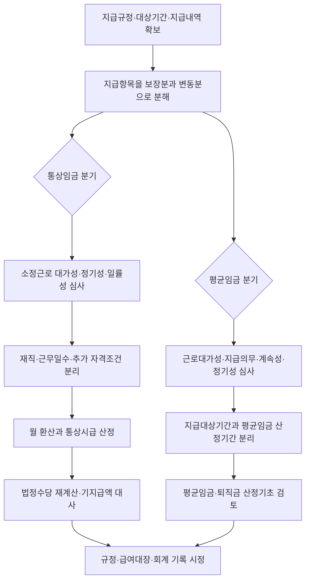

# 상여금·성과급의 통상임금·평균임금 및 법정수당 재산정 가이드

> **적용 기준**
> 이 문서는 정기상여·성과연봉·인센티브의 지급구조를 해체하여 통상임금, 평균임금 및 법정수당 재산정으로 이어 주는 허브다. 항목 명칭, 실제 지급일 또는 과거 최저지급률만으로 결론을 내리지 말고 지급대상기간의 규정·산식·운용기록을 함께 확인한다.

## 이 가이드에서 먼저 갈라지는 세 질문

같은 상여금·성과급이라도 아래 세 질문은 서로 대체되지 않는다.

| 질문 | 먼저 확정할 것 | 중심 문서 | 다음 단계 |
|:---|:---|:---|:---|
| 통상임금에 들어가는가 | 소정근로 대가성·정기성·일률성, 조건의 객관적 성질 | [[2024년 통상임금 고정성 배제 법리]] | 월 환산·통상시급·법정수당 재계산 |
| 평균임금의 임금총액에 들어가는가 | 근로대가성·사용자 지급의무·계속성·정기성, 산정기간 귀속 | [[성과급의 평균임금성 판단 규칙]] | 평균임금·퇴직금 산정기초 검토 |
| 상여금 자체를 청구할 수 있는가 | 지급일 재직조건·일할계산·퇴직자 처리 등 지급조건의 효력 | [[임금 재직조건의 유효성 판단 규칙]] | 지급청구권·정산 범위 확정 |

통상임금은 고정성을 독립 요건으로 요구하지 않고, 소정근로의 대가로 정기적·일률적으로 지급하기로 정한 임금인지를 본다. 따라서 “지급일에 재직하지 않으면 못 받는다” 또는 “평가 결과가 나와야 액수가 정해진다”는 문구 하나만으로 자동 제외하지 않는다. ^guide-ordinary-wage-branch

반면 평균임금은 근로기준법상 임금성을 전제로 산정사유 발생일 전 3개월의 임금총액을 계산하는 제도다. 통상임금 포함 여부와 평균임금 산입 여부를 같은 체크박스로 처리하면 안 된다. ^guide-average-wage-branch

## 한눈에 보는 판단 흐름

## 1. 지급항목을 일곱 구조로 먼저 분류한다

| 지급구조 | 통상임금 분기 | 평균임금 분기 | 바로갈 문서 |
|:---|:---|:---|:---|
| 정기상여 | 지급주기·산식·소정근로 대가를 확인한다. | 임금성 및 산정사유 전 3개월과의 귀속을 별도로 본다. | [[정기상여금 지급구조]] |
| 재직조건부 정기상여 | 재직조건 자체로 자동 제외하지 않는다. 청구권 문제와 분리한다. | 재직조건의 효력, 지급대상기간 및 실제 귀속을 기록한다. | [[재직조건부 정기상여금 사실유형]] |
| 근무일수 조건 | 소정근로일수 이내의 조건인지부터 본다. | 임금성이 인정된 뒤 평균임금 산정기간과의 관계를 별도 확인한다. | [[15일 근무 조건부 상여금]] |
| 추가 자격조건 | 무사고·특정 성과 등 소정근로 외 추가 요건이면 대가성이 약화될 수 있다. | 지급의무와 근로대가성을 처음부터 다시 심사한다. | [[중대 교통사고 비유발 조건부 상여금 사실유형]] |
| 최소보장 성과급 | 사전에 보장된 최소분만 통상임금 후보로 분리한다. | 최소보장분과 평가 변동분 모두 임금성·귀속을 별도 검토한다. | [[성과급 최소보장분의 통상임금성 판단 규칙]] |
| 개인·팀 목표 인센티브 | 보장된 기초분이 없다면 순수 성과분인지 확인한다. | 목표·평가·지급의무가 근로성과와 직접·밀접한지 심사한다. | [[목표달성도 연동 인센티브]] |
| 기업 재무성과급 | 사전 보장분이 있는지와 소정근로 대가성을 구분한다. | 영업이익·EVA 등 재무성과 분배 구조라면 임금성부터 엄격히 확인한다. | [[재무지표 연동 경영성과급]] |

각 행은 잠정 분류일 뿐이다. 하나의 성과급에도 `사전 보장된 최소분`과 `평가에 따라 달라지는 변동분`이 함께 있을 수 있으므로, 전액을 한 번에 통상임금 또는 평균임금으로 처리하지 않는다.

## 2. 정기상여의 조건은 세 갈래로 나눠 읽는다

### 재직조건: 청구권의 효력과 통상임금성은 다르다

지급일 재직조건은 상여금 자체의 지급대상 또는 지급기준으로 유효할 수 있다. 그러나 그 결론이 곧바로 “이미 제공한 소정근로의 대가인 정기상여가 통상임금이 아니다”라는 뜻은 아니다. 규정 문언, 중도퇴직자 일할지급 관행, 지급대상기간과 지급일의 관계를 나눠 기록한다.

| 확인 자료 | 지급청구권 분기 | 통상임금 분기 |
|:---|:---|:---|
| 지급일 재직 문구 | 퇴직자에게 해당 상여를 지급할 의무가 있는지 | 조건이 있어도 소정근로 대가성·정기성·일률성이 남는지 |
| 퇴직자·휴직자 일할지급 관행 | 문언과 달리 비례 지급의 관행이 있는지 | 후불 정기임금 구조를 뒷받침하는지 |
| 근속·입사 제한 | 지급대상·산정 비율을 정한 것인지 | 소정근로 외 추가 자격요건인지 |

### 근무일수 조건: 소정근로 안의 문턱인지 본다

근무일수 조건은 숫자만으로 결론 내지 않는다. 해당 기준기간의 소정근로일수와 비교하여, 통상적인 근로자가 소정근로를 온전하게 제공하면 충족할 수 있는 조건인지 확인한다. 예컨대 [[15일 근무 조건부 상여금]]은 이 분기의 대표 사례다.

[[대법원 2024. 12. 19. 선고 2023다302838 전원합의체 판결]]은 이 분기의 직접 보조 판례로 연결한다. 다만 해당 판례 문서는 현재 `draft` 상태이므로, 이 Guide에서는 검증된 [[근무일수 조건부 임금의 통상임금성 판단 규칙]]을 적용 기준으로 사용하고, 실제 사건 적용 전에는 판결 원문과 연결 Rule을 함께 재검토한다.

### 추가 자격조건: 근무일수와 섞지 않는다

근무일수 조건이 소정근로일수 이내여도 무사고·안전성과·특정 자격 유지처럼 별도 성과나 자격을 요구하는 조건은 다르다. [[중대 교통사고 비유발 조건부 상여금 사실유형]]처럼 여러 조건이 결합되면, 각 조건이 소정근로의 대가성을 부정하는지 따로 심사한다.

## 3. 성과급은 지급연도와 지급대상기간을 분리한다

성과급의 최소보장분은 실제 지급액의 최저치나 지급연도만으로 정하지 않는다. 지급대상기간 당시의 취업규칙·보수규정·단체협약·확립된 관행에 최저 지급률, 하한액 또는 객관적 산식이 있었는지를 확인한다. 전년도 근무실적에 대한 성과급을 다음 해에 지급했다면, 지급 시기가 다음 해라는 사정만으로 다음 해 통상임금에 넣지 않는다. ^guide-minimum-guarantee-target-period

| 구분 | 반드시 남길 자료 | 통상임금 처리의 출발점 |
|:---|:---|:---|
| 최소보장분 | 지급대상기간의 규정, 최소율·하한액·산식, 최하위 등급 지급 구조 | 사전에 보장된 부분만 따로 검토 |
| 변동분 | 평가표, 등급별 지급률, 사용자 재량, 외부예산 기준 | 순수 성과분이면 소정근로 대가성이 약화될 수 있음 |
| 지급연도 | 급여대장·원천자료·실제 지급일 | 현금 지급·회계 처리 시점으로 기록 |
| 지급대상기간 | 평가기간·근무기간·귀속 규정 | 최소보장분 존재 및 통상임금 반영 연도를 판단 |

[[한수원 기본성과급 전년도 귀속 및 최소지급분 사실유형]]은 실제 최저 지급률과 법적으로 보장된 최소지급분을 동일시하지 말아야 함을 보여 준다. 반대로 [[외부기준 변동 자체평가급 최소보장 부재]]는 외부 예산기준과 사후 결정만으로 최소보장분을 인정하기 어려운 구조를 보여 준다.

## 4. 평균임금 분기는 통상임금 분기와 독립한다

성과급의 평균임금성은 다음 세 축을 함께 본다.

1. 금품 지급의무가 근로제공과 직접 또는 밀접하게 관련되는가
2. 규정·계약·단체협약 또는 확립된 노동관행에 따라 사용자가 지급을 거절할 수 없는가
3. 계속적·정기적으로 지급되는 제도인가

개인·팀 목표 인센티브는 목표·평가기준·지급대상·지급률이 사전에 구체화되고 근로성과와 밀접하면 평균임금 산정기초 임금으로 인정될 수 있다. 반면 영업이익·당기순이익·EVA 등 재무지표의 발생과 규모에 주로 연동되는 경영성과급은 근로대가성이 부족하여 임금성부터 부정될 수 있다. ^guide-financial-performance-boundary

| 구조 | 평균임금 분기에서 묻는 질문 | 출발 사례 |
|:---|:---|:---|
| 개인·팀 목표 인센티브 | 근로자가 목표 달성에 영향을 미칠 수 있고, 조건 충족 시 지급의무가 있는가 | [[대법원 2026. 1. 29. 선고 2021다248299 판결]] |
| 공공기관 경영평가·성과연봉 | 최소보장분과 평가변동분, 지급대상기간 당시 규정을 분리했는가 | [[공공기관 성과연봉 최소보장분 사실유형]] |
| 기업 재무성과급 | 재원·선행조건이 사업이익·자본·시장상황처럼 근로 외 요인에 좌우되는가 | [[대법원 2026. 3. 12. 선고 2025다210219 판결]] |
| 매년 별도 교섭·결정형 | 반복 지급이 기존 의무의 이행인지, 매년 새 재량적 결정인지 | [[성과급의 평균임금성 판단 규칙]] |

이 가이드에서는 성과급의 평균임금성까지 판정한다. 산정사유 발생일 전 3개월의 제외기간, 퇴직금 법정 하한 및 퇴직금 산식 자체는 [[평균임금]]과 관련 Law·Rule에서 별도로 확인한다.

## 5. 통상임금이 바뀐 경우 법정수당을 재산정한다

통상임금에 새 항목 또는 최소보장분이 들어갔다고 하여 차액을 한 번에 계산하지 않는다. 다음 순서로 산정기초와 기지급액을 대사한다.

1. **대상기간 고정**: 어떤 월·분기·연도의 법정수당을 다시 계산하는지 확정한다.
2. **산입액 분리**: 정기상여 전액인지, 성과급의 최소보장분만인지, 다른 통상임금 항목과 중복되는지 표시한다.
3. **월 환산**: 해당 지급대상기간에 대응하는 통상임금 산입액을 월 단위로 환산한다. 지급주기와 산정기간이 다른 항목은 산식을 기록한다.
4. **통상시급 산정**: 월 통상임금을 해당 근로자의 법정·약정 산정 기준시간 수로 나눈다. 모든 근로자에게 하나의 고정 시간 수를 기계적으로 적용하지 않는다.
5. **적용시간 확정**: 실제 연장·야간·휴일시간, 유효한 보장시간 또는 간주시간 약정 중 해당 근거의 시간을 확정한다.
6. **법정수당 계산**: 재산정 통상시급에 확정된 시간과 법정 가산율을 적용한다.
7. **기지급액 대사**: 같은 시간·같은 수당에 이미 지급된 기본분·가산분을 구분해 차감하고, 급여대장·임금명세서·회계전표를 함께 수정한다.

월급으로 정한 통상임금은 시행령 제6조 제2항의 시간급 환산 구조를 따르고, 연장·야간·휴일근로의 가산임금은 근로기준법 제56조에 따라 산정한다. 따라서 재산정은 `월 환산 → 통상시급 → 적용시간 → 법정 가산 → 기지급액 대사` 순서를 지킨다. ^guide-statutory-allowance-recalculation

유효한 보장시간 합의가 있으면 실제 시간이 보장시간에 미달하더라도 곧바로 실제시간으로 바꾸지 않는다. [[보장근로시간 합의에 따른 법정수당 재산정 규칙]]과 [[보장시간 합의 후 법정수당 재산정]]에서 합의의 유효성 및 적용시간을 먼저 확인한다.

## 6. 공공기관 성과급은 총인건비와 법적 분류를 분리해 기록한다

공공기관의 성과연봉·경영평가성과급은 총인건비, 예산운영지침, 경영평가와 연결되어 있으나 그 사정만으로 통상임금성 또는 평균임금성이 정해지지는 않는다. 먼저 지급대상기간 당시의 최소보장분·산식·사용자 지급의무를 확인하고, 그 뒤 총인건비·예산·회계 반영의 실행문제를 별도 관리한다. ^guide-public-institution-caveat

| 기록 묶음 | 확인 내용 |
|:---|:---|
| 법적 분류 | 소정근로 대가성, 최소보장분, 평균임금상 임금성 |
| 시간축 | 지급대상기간, 지급연도, 실제 지급일, 재산정 대상 법정수당 기간 |
| 운영 제약 | 총인건비·예산지침, 기관 내부 보수규정, 노사협의·변경 절차 |
| 정산 결과 | 통상시급 변화, 법정수당 차액, 기지급액, 회계·급여대장 조정 |

공공기관 성과급의 최신 법리는 구조별로 축적 중이므로, 실제 기관별 산식과 해당 연도 지침을 연결 문서의 기준일 이후에도 재확인한다.

## 판례·사실유형 바로가기

| 쟁점 | 우선 문서 | 이 문서에서 확인할 것 |
|:---|:---|:---|
| 재직조건부 정기상여 | [[대법원 2024. 12. 19. 선고 2020다247190 전원합의체 판결]] | 조건의 효력과 통상임금성의 분리 |
| 15일·분기 근무일수 조건 | [[대법원 2024. 12. 19. 선고 2023다302838 전원합의체 판결]] (draft·원문 재확인) | 소정근로일수 이내 조건과 정기상여 구조 |
| 최소보장 성과급 | [[대법원 2025. 8. 14. 선고 2023다216777 판결]] | 최소보장분 존재 시점과 지급대상기간 |
| 사전 보장 없는 자체평가급 | [[대법원 2026. 4. 16. 선고 2024다316599 판결]] | 외부기준·사후 결정과 최소보장 부재 |
| 목표 인센티브와 EVA 성과급 | [[대법원 2026. 1. 29. 선고 2021다248299 판결]] | 평균임금성의 긍정·부정 분기 |
| 재무지표 연동 경영성과급 | [[대법원 2026. 3. 12. 선고 2025다210219 판결]] | 경영성과 분배형의 근로대가성 한계 |

## 증빙·대사 체크리스트

- 지급규정·단체협약·취업규칙의 해당 연도 원문과 개정 이력
- 지급대상기간, 평가기간, 지급일, 권리확정일을 분리한 시간표
- 최하위 등급·최저 지급률·실제 지급액을 나란히 둔 지급률표
- 개인·팀 목표, 재무지표, 외부예산 기준, 사용자 재량의 근거자료
- 근태·연장·야간·휴일근로 기록과 보장시간·간주시간 약정
- 대상기간별 월 환산표, 통상시급 산출표, 법정수당 재계산표
- 기지급 수당의 기본분·가산분, 원천·사회보험·회계 대사자료
- 취업규칙·임금규정 변경이 있으면 절차와 시행일을 확인한 자료

## 검토 한계와 변경 감시

이 문서는 판정 순서를 제공하며, 개별 근로자의 청구권·소멸시효·퇴직금·세금·사회보험 결론을 일괄 확정하지 않는다. 특히 성과급은 지급제도와 연도별 규정이 바뀌면 같은 명칭이라도 결론이 달라질 수 있다.

2024년 통상임금 법리, 성과급 최소보장분의 지급대상기간 판단, 2026년 사기업 성과급 평균임금성 판례, 고용노동부 노사지도 지침 또는 공공기관 예산운영기준이 변경되면 이 Guide와 연결 Rule을 함께 재검토한다.
