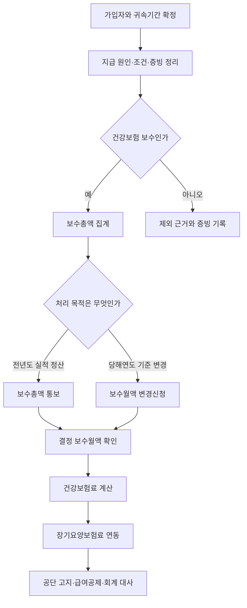

# 직장건강보험 보수·보험료 판단 실무 가이드

> **적용 기준**
> 2026-07-26 현재 일반 직장가입자의 보수월액보험료와 이에 연동되는 장기요양보험료를 대상으로 한다. 급여항목의 법적 성격, 귀속기간, 가입자 자격과 신고 목적을 먼저 확정하고, 실제 제출·공제액은 공단의 최신 수신문서와 산출내역서를 우선한다.

## 이 가이드의 역할

이 문서는 흩어진 건강보험 문서를 질문 순서대로 연결하는 허브다. 여기서 결론을 모두 대신하지 않는다. `급여항목 → 보수 → 보수총액 → 보수월액 → 건강보험료 → 장기요양보험료 → 신고·정산`의 어느 단계에서 문제가 생겼는지 찾고, 해당 Rule·Law·공단 안내로 이동하게 한다.

직장가입자의 보수월액은 단순한 월 급여총액이나 실수령액이 아니다. 먼저 근로의 대가인 금품에서 실비변상적 금품 등 법정 제외항목을 구별하고, 자격기간·근무개월수·변경사항을 반영하여 보험료 부과기초로 연결한다. ^guide-nhis-remuneration-base

## 질문별 바로가기

| 지금 가진 질문 | 먼저 볼 문서 | 그 문서에서 확정할 것 |
|:---|:---|:---|
| 보수·보수총액·보수월액의 차이는 무엇인가 | [[건강보험 보수월액]] | 네 개념과 전체 형성 경로 |
| 이 수당·상여·지원금이 보수에 들어가는가 | [[건강·장기요양보험 보수월액 산입 규칙]] | 지급 실질, 실비변상성, 법정 제외·재산입 |
| 조문상 포함·제외 근거가 필요한가 | [[국민건강보험법 시행령 제33조 보수에 포함되는 금품]] | 명시적 제외, 자료 불명확, 현물 평가 |
| 보수총액 신고와 보수월액 변경 중 무엇을 해야 하는가 | [[국민건강보험공단 2026 보수월액 업무안내]] | 대상자, 근무개월수, 변경월·사유, EDI 흐름 |
| 2026년 보험료를 검산하려는가 | [[2026년 건강·장기요양보험료율 규칙]] | 건강보험 7.19%, 장기요양 연동 산식, 부담 배분 |
| 장기요양보험료가 왜 건강보험료에 따라 바뀌는가 | [[노인장기요양보험법 제9조 장기요양보험료 산정]] | 법정 연동 구조와 정산 전파 |
| 제도가 왜 이렇게 나뉘었는가 | [[직장건강보험 보수월액과 장기요양보험료 연동의 연혁]] | 보수 기반 부과·연간 정산·장기요양 연동의 배경 |
| 건강보험 외 세금·다른 사회보험도 함께 판정해야 하는가 | [[급여항목 법적 분류 실무 가이드]] | 아홉 법 영역의 독립 판정 순서 |

## 한눈에 보는 판단 흐름



## 1단계: 사건의 범위부터 고정한다

다음 다섯 값을 먼저 적는다.

1. 가입자 유형과 자격취득·상실·변동일
2. 검토 대상 급여코드와 지급 원인
3. 급여의 귀속기간, 권리확정일과 실제 지급일
4. 검토 목적: 항목 판정, 전년도 정산, 당해연도 변경, 고지액 검산 또는 오류 정정
5. 적용 연도와 해당 연도의 법령·요율 버전

이 가이드는 일반 직장가입자의 보수월액보험료를 기본값으로 한다. 보수 외 소득월액보험료, 지역가입자 보험료, 휴직자, 국외근무자, 보수가 없는 사용자, 임의계속가입자 등은 일반 산식을 그대로 적용하지 말고 별도 규정을 확인한다.

## 2단계: 급여항목이 보수인지 판정한다

급여코드의 명칭을 지우고 다음 순서로 묻는다.

1. 근로 제공의 대가로 사용자 등에게서 받은 금품인가
2. 실제 지출액을 증빙에 따라 돌려받은 실비변상인가
3. 퇴직금 등 시행령 제33조가 명시적으로 제외한 금품인가
4. 비과세 근로소득이라면 원칙적 제외와 단서상 재산입 중 어디에 해당하는가
5. 현물이라면 보수 해당 여부와 공단 평가액을 확인했는가
6. 자료가 없거나 불명확하여 법정 대체기준을 적용할 사정이 있는가

보수에는 봉급·급료·임금·상여·수당 등 근로대가 금품이 넓게 들어가지만, 퇴직금·일정한 비과세 근로소득·실비변상적 금품 등은 별도 경계를 가진다. 과세 여부나 근로기준법상 임금성 하나만 복사하지 말고 시행령 제33조의 포함·제외 구조를 독립 적용한다. ^guide-nhis-item-boundary

### 자주 찾는 사실유형

| 지급구조 | 출발 문서 | 건강보험에서 먼저 확인할 사실 |
|:---|:---|:---|
| 기본급·직무수당 | [[정액 기본급 지급]] | 근로대가와 다른 금품의 혼입 여부 |
| 정기상여 | [[정기상여금 지급구조]] | 산정기간, 지급조건, 귀속과 실제 지급 |
| 개인·팀 성과급 | [[목표달성도 연동 인센티브]] | 근로성과 연동, 최소보장분, 평가기간 |
| 회사 재무성과급 | [[재무지표 연동 경영성과급]] | 지급원인과 근로대가성, 지급의무 |
| 현금 식대 | [[현금 식대 정액 지급]] | 비과세 요건과 시행령상 보수 재산입 여부 |
| 자가운전보조금 | [[자가운전보조금 정액 지급]] | 정액수당인지 실제 비용상환인지 |
| 보육급여 | [[자녀 보육급여 정액 지급]] | 대상자·한도와 보수 제외·재산입 근거 |
| 연장·야간·휴일수당 | [[생산직 연장·야간·휴일수당]] | 근로대가와 비과세 요건의 별도 판정 |
| 복지포인트 | [[사용제한형 선택적 복지포인트]] | 사용·양도·현금화 제한과 경제적 이익 구조 |
| 출장비·여비 | [[증빙 기반 실비 여비 정산]] | 출장 사실, 영수증, 실제 지출과의 일치 |
| 연차 미사용수당 | [[연차유급휴가 및 미사용수당]] | 권리확정·귀속·지급 시점 |
| 직무발명보상금 | [[재직 중·퇴직 후 직무발명보상금]] | 권리승계 대가와 근로대가의 구별 |

## 3단계: 보수총액과 근무개월수를 확정한다

보수로 판정한 지급행을 대상자별·귀속기간별로 합산한다. 매월 지급되지 않은 상여나 성과급도 `비정기`라는 이유만으로 빼지 않는다. 다음을 급여대장과 인사자료에서 대조한다.

- 급여코드별 산입액과 제외액
- 자격취득·상실·변동일
- 근무개월수와 휴직기간
- 소급지급·환수·정정액의 귀속기간
- 공단이 보낸 대상자 목록과 내부 인사명부의 차이

`보수총액 ÷ 근무개월수`는 유용한 설명·검산값이지만, 공단이 실제로 결정·적용한 보수월액과 항상 같다고 단정하지 않는다.

## 4단계: 신고 목적을 구분한다

| 구분 | 전년도 보수총액 통보 | 당해연도 보수월액 변경신청 |
|:---|:---|:---|
| 목적 | 지나간 연도의 실제 보수 정산 | 당해연도 부과기초 변경 |
| 핵심 입력 | 전년도 보수총액, 근무개월수 | 변경 후 보수월액, 변경월, 변경사유 |
| 기준 자료 | 공단 수신 대상자, 전년도 급여대장 | 임금변경 자료, 적용 시작월 |
| 주요 오류 | 상여 누락, 산정월수 오류, 대상자 누락 | 변경월 지연, 사유 미기재, 소급범위 오류 |
| 상세 절차 | [[국민건강보험공단 2026 보수월액 업무안내]] | [[국민건강보험공단 2026 보수월액 업무안내]] |

두 절차를 하나의 `건강보험 신고`로 뭉뚱그리지 않는다. 최초 신고값, 정정값, 차이 원인, 제출일과 공단 처리결과를 함께 보관해야 재정산을 재현할 수 있다.

## 5단계: 건강보험료와 장기요양보험료를 계산한다

2026년 일반 직장가입자의 건강보험료율은 7.19%이고 장기요양보험료율은 0.9448%다. 연도가 바뀌면 이 절의 수치를 재사용하지 말고 해당 연도 Rule을 확인한다. ^guide-nhis-rate-2026

```text
건강보험료 총액의 검산값 = 확정 보수월액 × 7.19%
장기요양보험료 총액의 검산값 = 경감·면제 후 건강보험료 × 0.9448 ÷ 7.19
```

장기요양보험료는 급여항목을 다시 분류해 별도의 보수월액을 만드는 방식이 아니다. 건강보험료를 기초로 법정 요율의 비를 적용하므로 보수월액이나 건강보험 정산액이 바뀌면 장기요양보험료도 함께 바뀐다. ^guide-nhis-ltc-formula

일반적인 가입자와 사용자의 부담은 각각 50%지만, 실제 급여공제·회계처리에는 공단의 경감·면제, 원 단위 처리와 산출내역서의 정수 고지액을 사용한다. `0.9448%`를 건강보험료에 그대로 곱하거나 표시비율 `13.14%`와 중복 적용하지 않는다.

## 6단계: 차이를 역추적한다

| 관찰된 차이 | 먼저 조사할 단계 | 주요 원인 후보 |
|:---|:---|:---|
| 급여대장 보수총액 ≠ 공단 통보액 | 보수 판정·집계 | 상여 누락, 실비 오분류, 귀속연도 오류 |
| 보수총액은 같고 보수월액만 다름 | 근무개월수·자격·변경 | 취득·상실월, 휴직, 변경월, 산정월수 |
| 보수월액은 같고 건강보험료가 다름 | 요율·예외·고지 | 귀속연도, 국외근무, 경감·면제, 원 단위 처리 |
| 건강보험료는 같고 장기요양보험료만 다름 | 장기요양 산식 | 연도 요율, 중간 반올림, 경감 기초액 |
| 공단 고지액은 맞고 급여공제만 다름 | 급여·회계 반영 | 부담주체, 다음 달 상계, 정정분 누락 |
| 보험료와 납부액이 다름 | 회계·납부 대사 | 예수금·미지급금, 납부월 불일치, 환급 상계 |

차이 원인은 `공단 계산 차이`처럼 적지 않는다. `2025년 성과상여 급여코드 4,800,000원 누락`, `자격취득월을 근무개월수에서 제외`처럼 대상 기간·금액·급여코드를 재현할 수 있게 적는다.

## 공통 증빙 묶음

| 판단 단계 | 우선 확보할 자료 |
|:---|:---|
| 가입자·기간 | 자격취득·상실·변동 자료, 인사발령, 휴직·복직 기록 |
| 지급 실질 | 근로계약, 취업규칙, 단체협약, 급여·상여·성과급 규정 |
| 산입·제외 | 급여코드 정의, 비과세 코드, 출장명령·영수증·정산서 |
| 보수총액 | 월별 급여대장, 소급·환수 내역, 원천징수 자료 |
| 신고 | 공단 수신 대상자, 보수총액 통보서, EDI 접수결과 |
| 변경 | 보수변경 결재, 변경 후 보수월액, 변경월·변경사유 |
| 보험료 | 공단 산출내역서, 고지서, 경감·면제 내역 |
| 공제·회계 | 급여공제, 사용자부담 전표, 예수금·미지급금, 납부서 |

## 판정기록 최소 양식

```text
대상자 / 식별키:
가입자 유형 / 자격기간:
검토 목적:
적용 법령·요율 기준일:

급여항목:
  - 코드·명칭:
  - 지급 원인·대상·조건:
  - 산식·귀속기간·지급일:
  - 현금·현물·비용상환 여부:
  - 증빙:

보수 판정:
  - 결론:
  - 적용 Rule·Law:
  - 제외 또는 재산입 근거:
  - 반대 결론을 만드는 사실:

집계·신고:
  - 급여대장 보수총액:
  - 근무개월수:
  - 공단 통보액 / 결정 보수월액:
  - 보수총액 통보 또는 변경신청:
  - 변경월·변경사유:

보험료·대사:
  - 건강보험료 / 장기요양보험료:
  - 가입자 공제 / 사용자 부담:
  - 차이와 원인:
  - 정정일·처리결과:

검토자 / 검토일 / 다음 재검토 트리거:
```

## 흔한 오류

- `급여총액`, `보수총액`, `보수월액`, `보험료`를 같은 값처럼 사용한다.
- 급여코드 명칭이나 세법상 비과세 코드만 보고 보수 제외를 확정한다.
- 연 1회 상여를 비정기 지급이라는 이유로 보수총액에서 뺀다.
- 정액 여비를 영수증 일치 실비와 동일하게 처리한다.
- 전년도 보수총액 통보와 당해연도 보수월액 변경을 같은 신고로 본다.
- 장기요양보험료율 0.9448%를 건강보험료에 그대로 곱한다.
- 공단 고지액과 급여프로그램 예상액의 차이를 모두 반올림 탓으로 돌린다.
- 보수 정정 후 건강보험료만 고치고 장기요양보험료와 사용자부담 전표를 남긴다.
- 2026년 요율을 다른 귀속연도에 그대로 사용한다.

## 권위 순서와 문서 지도

1. **법률:** [[국민건강보험법 제70조·제73조]], [[노인장기요양보험법 제9조 장기요양보험료 산정]]
2. **시행령:** [[국민건강보험법 시행령 제33조 보수에 포함되는 금품]], [[노인장기요양보험법 시행령 제4조 장기요양보험료율]]
3. **판정 Rule:** [[건강·장기요양보험 보수월액 산입 규칙]], [[2026년 건강·장기요양보험료율 규칙]]
4. **공단 실무:** [[국민건강보험공단 2026 보수월액 업무안내]]
5. **개념·배경:** [[건강보험 보수월액]], [[직장건강보험 보수월액과 장기요양보험료 연동의 연혁]]
6. **구체적 지급구조:** 위 `자주 찾는 사실유형` 표의 Fact Pattern

법적 범위가 공단 화면의 입력설명과 충돌하면 상위 법령을 우선하되, 실제 신고가 막히거나 다른 방식으로 처리되는 경우에는 공단 안내와 처리내역을 별도 기록한다.

## 검토 한계와 변경 감시

- 이 가이드는 `review` 상태다. 연결된 법령과 2026년 요율 Rule은 검증되었으나, 공단 서식·EDI 절차는 실제 제출 직전 최신 화면과 수신문서를 다시 확인한다.
- 2026-11-27 시행 예정인 「노인장기요양보험법」 제9조 개정은 장기요양보험료 산식의 반올림 위치를 명확히 하므로 시행일을 걸치는 정산은 귀속월별 버전을 구분한다.
- 보수 외 소득월액보험료, 지역가입자 보험료와 특수 가입자·휴직자 산정은 이 문서의 일반 계산 예시 범위 밖이다.
- 하나의 급여항목을 소득세·국민연금·고용·산재보험까지 함께 판단해야 하면 [[급여항목 법적 분류 실무 가이드]]에서 각 제도의 독립 판정을 이어 간다.
