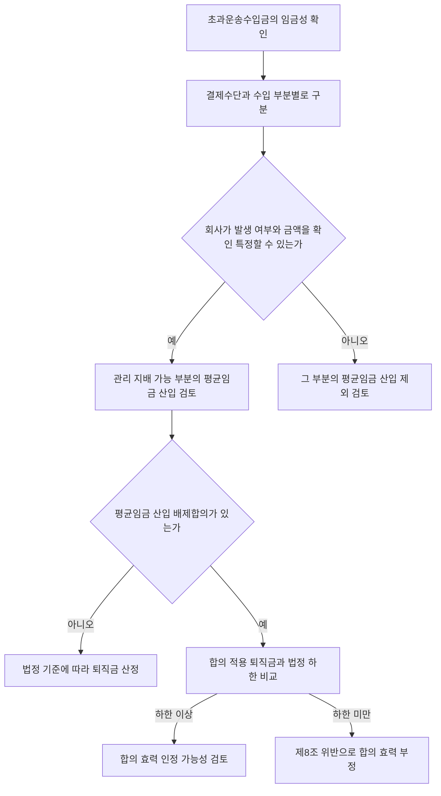

# 택시 초과운송수입금 관리·지배와 퇴직금 판단 가이드

> **사용 기준일**: 2026-07-25. 이 가이드는 [[대법원 2026. 1. 29. 선고 2025다217529·217530 판결]]의 관리·지배 법리와 파기환송 이유를 빠르게 적용하기 위한 출발점이다. 최종 산입액은 결제 수단·수입 부분별 객관 자료와 퇴직 시점의 법정 기준으로 다시 확인한다.

## 한 줄 결론

초과운송수입금이 임금에 해당하더라도 자동으로 전액 산입되는 것은 아니다. 회사가 각 수입 부분의 발생 여부와 금액 범위를 객관적으로 확인·특정할 수 있는지를 먼저 구분하고, 평균임금 산입 배제합의가 있으면 합의 적용 퇴직금이 법정 하한을 충족하는지 별도로 비교한다.

## 이 가이드의 범위 밖: 소정근로시간과 최저임금 잠탈

[[택시 소정근로시간과 최저임금 잠탈 판단 규칙]]은 정액사납금제 택시에서 실제 근로시간과 소정근로시간의 괴리 또는 최저임금 회피 목적을 검토하는 별도 경로다. 이 가이드는 초과운송수입금의 관리·지배, 평균임금 산입 및 퇴직금 하한만 다루므로, 소정근로시간 합의의 유효성이나 최저임금 비교대상 시급은 그 Rule에서 별도로 판단한다.

## 관리·지배의 의미와 법적 기능

이 판례군에서 관리·지배 기준의 기능은 사용자가 장래 퇴직금 출연액을 예측할 수 있게 하는 데 있다. 평균임금 산정기간에 지급된 임금이라도 사용자가 관리하거나 지배할 수 없는 부분은 그 범위에서 평균임금 산입에서 제외될 수 있다. ^guide-control-purpose

따라서 기준은 수입의 소유권·최종 귀속이나 회사의 임의 처분권 그 자체가 아니라, 회사가 객관적인 자료로 해당 수입의 **발생 여부와 금액 범위를 확인·특정할 수 있는지**다. 회사 계좌 입금, 결제 대행 정산 자료, 기사별 운행·미터 자료처럼 확인 경로가 있는지를 결제 수단·수입 부분별로 본다. ^guide-management-standard

회사가 납부받은 초과운송수입금을 나중에 근로자에게 지급했다는 사정만으로 관리·지배가 부정되지는 않는다. 반대로 근로자가 현금 수입을 직접 보유하고 회사가 발생 여부나 금액을 알 수 없다면, 그 직접 보유 부분은 관리·지배가 없는 것으로 판단한다.

## 판단 흐름

이 흐름은 [[근로기준법상 임금성 판단 규칙]]과 [[택시 초과운송수입금의 평균임금 및 퇴직금 하한 판단 규칙]]을 순서대로 사용하는 방법이다. `관리·지배`는 임금성을 대신하는 기준이 아니라, 임금으로 인정된 초과운송수입금 중 평균임금 산입범위를 가르는 기준이다.

## 결제수단·수입 부분별 판단표

| 수입 부분 | 우선 확인할 객관 자료 | 관리·지배 판단 방향 | 실무 처리 |
|---|---|---|---|
| 카드 결제분 | 회사 명의 계좌 입금내역, 카드사·결제대행 정산자료, 기사별 카드·미터 기록 | 회사가 발생과 금액 범위를 확인·특정할 수 있으면 긍정 방향 | 해당 부분을 평균임금 산입 대상으로 검토 |
| 현금 직접 보유분 | 현금 납부장부, 영수증, 운행기록, 회사의 정산·대사 자료 | 회사가 발생 여부와 금액을 알 수 없으면 그 부분은 부정 방향 | 해당 부분을 분리하여 산입 제외 여부 검토 |
| 앱 결제분 | 플랫폼 정산서, 입금 계좌, 배차·운행 기록, 회사 정산 자료 | 카드분과 마찬가지로 실제 확인·특정 가능성에 따라 판단 | 결제 수단의 명칭만으로 결론 내리지 않고 정산 흐름을 대사 |
| 카드·현금·앱 혼합분 | 각 결제수단별 원장과 기사별 운행자료 | 일부 긍정·일부 부정의 혼합 결론 가능 | 금액을 하나로 뭉치지 말고 부분별로 산정 |

## 긍정·부정·혼합 사실유형

### 긍정 방향: 회사계좌 입금과 기사별 자료가 함께 있는 경우

회사 명의 계좌에 카드 결제대금이 입금되고, 회사가 관리한 기사별 운행자료에 운행일별 카드 결제대금과 미터금이 기재되어 있다면, 회사가 해당 초과수입금의 발생 여부와 금액 범위를 확인·특정할 수 있는 자료가 된다. 이 사건에서 대법원은 그러한 사정을 근거로 ‘추가금’을 회사가 관리·지배하고 있었다고 **볼 여지가 크다**고 보았다. ^guide-case-application

### 부정 방향: 기사가 현금을 직접 보유하고 회사가 알 수 없는 경우

기사가 사납금 초과 현금을 개인 수입으로 직접 귀속시키고 회사가 그 발생 여부나 금액 범위를 알 수 없다면, 그 개인 수입 부분은 관리·지배가 없는 범위로 본다. 여기서도 결론은 현금이라는 명칭 자체가 아니라 회사의 정산·대사 자료가 실제로 존재하는지에 달려 있다.

### 혼합: 결제수단별로 결론이 갈리는 경우

카드분은 회사계좌와 운행자료로 확인되지만 현금분은 기사가 직접 보유한 상태라면, 카드분과 현금분을 각각 판단한다. 초과운송수입금 전체를 일괄 포함하거나 일괄 제외하지 않는 것이 이 가이드의 핵심이다.

## 퇴직금 하한 비교 절차

1. 먼저 임금성이 인정되고 관리·지배 가능한 수입 부분을 확정한다.
2. 그 부분을 반영한 법정 평균임금을 전제로 퇴직급여법이 보장하는 퇴직금 하한을 산정한다.
3. 근로계약·임금협정에 평균임금 산입 배제합의가 있으면, 그 합의에 따라 산정한 퇴직금액을 따로 계산한다.
4. 합의 적용액이 법정 하한 이상이면 그 합의가 곧바로 무효라고 할 수 없지만, 하한에 미달하면 퇴직급여법 제8조에 위반하여 효력을 인정할 수 없다. ^guide-retirement-floor

비교의 대상은 ‘계약에 배제 문구가 있는가’가 아니라 **그 문구를 적용한 실제 퇴직금액이 법정 하한을 충족하는가**다. 따라서 배제 문구만으로 평균임금 산입 여부나 퇴직금액에 대한 결론을 내려서는 안 된다.

## 필요한 증빙

- 회사 명의 계좌의 카드·앱 결제대금 입금내역과 결제대행·플랫폼 정산서
- 기사별 운행일지, 미터금 기록, 배차·운행자료, 카드 결제대금 원장
- 사납금·추가금·성과급의 산식, 지급명세, 급여대장, 실제 지급내역
- 근로계약·임금협정의 평균임금 산입 또는 배제 조항
- 관리·지배 가능한 부분을 반영한 법정 하한 계산서와 배제합의 적용 계산서

자료가 부족하면 ‘회사계좌를 한 번 거쳤다’ 또는 ‘계약서에 관리 불가능 수입이라고 적었다’는 사정만으로 결론을 내리지 말고, 수입의 발생·정산·기록 흐름을 복원한다.

## 관련 문서의 역할과 바로가기

| 문서 | 맡는 역할 | 언제 열어볼지 |
|---|---|---|
| [[택시 초과운송수입금의 평균임금 및 퇴직금 하한 판단 규칙]] | 네 단계 판단의 규칙 | 실제 결론을 Rule 형식으로 적용할 때 |
| [[대법원 2026. 1. 29. 선고 2025다217529·217530 판결]] | 직접 권위와 파기환송 이유 | 원문 법리와 사건 사실을 확인할 때 |
| [[근로기준법 제2조 임금 및 평균임금 정의]] | 임금성과 평균임금의 법정 출발점 | 초과수입금의 임금성·산정 기초를 확인할 때 |
| [[회사계좌 입금·기사별 운행자료형 초과운송수입금]] | 회사계좌 입금·기사별 운행자료가 있는 사실유형 | 증빙 구조가 이 사건과 가까운지 비교할 때 |

## 판결이 확정하지 않은 범위와 파기환송 한계

이 사건에서 대법원은 회사의 관리·지배를 최종 확정해 퇴직금액을 직접 산정한 것이 아니다. 카드 결제대금의 회사계좌 입금과 기사별 자료를 바탕으로 관리·지배가 인정될 여지가 크다고 보고, 법정 하한 충족 여부를 심리하지 않은 원심을 파기환송했다. ^guide-remand-limit

따라서 현금분·앱 결제분 또는 다른 정산 구조에 이 판결을 적용할 때에는 각 수입 부분에서 회사가 실제 발생 여부와 금액을 확인·특정할 수 있었는지를 새로 확인해야 한다. 하한 비교 역시 사건별 평균임금과 퇴직금 계산 자료에 따라 달라지며, 이 판결만으로 구체적인 금액이 확정되는 것은 아니다.
