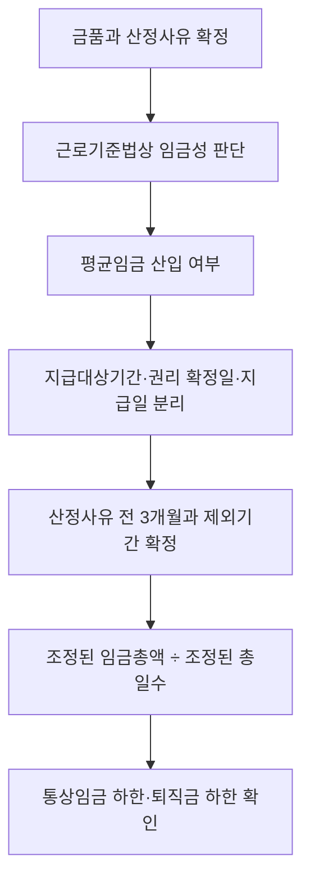

# 평균임금·퇴직금 산입 판단 실무 가이드

> **적용 기준**
> 2026-07-26 현재 평균임금을 퇴직금제도의 산정 기초로 연결하는 일반 절차다. 상여·성과급의 임금성은 별도 Guide, 택시 초과운송수입금은 기존 택시 Guide에서 먼저 판단한다.

## 이 가이드의 역할

평균임금은 단순히 `최근 3개월 입금액 ÷ 90`으로 계산하지 않는다. 근로기준법상 임금성, 평균임금 산입 여부, 산정 사유 발생 전 3개월, 법정 제외 기간, 지급 대상 기간과 권리 확정일·실제 지급일, 그리고 퇴직금 하한을 순서대로 연결해야 한다. ^guide-average-core

## 빠른 사용 순서

1. 퇴직일 등 평균임금 산정사유 발생일을 확정한다.
2. 퇴직 전 3개월의 달력 구간과 근태·휴직 자료를 먼저 정리한다.
3. 각 금품을 `임금성 → 평균임금 산입성 → 귀속·지급 기록` 순서로 판정한다.
4. 법정 제외기간과 그 기간 중 지급임금을 같은 행에서 함께 제외한다.
5. 조정된 임금총액과 총일수로 평균임금을 계산하고 통상임금 하한을 대조한다.
6. 퇴직금제도이면 계속근로기간과 1년당 30일분 평균임금 하한을 확인한다.

## 중심 판단 흐름

### 1. 임금성부터 고정

금품이 근로의 대가인지와 사용자에게 지급 의무가 있는지를 먼저 본다. 임금성이 불명확한 금품을 3개월 표에 넣어 평균임금만 계산하면, 나중에 산입 여부를 바꾸어야 할 때 분자·분모·퇴직금이 연쇄적으로 틀어진다. 출발점은 [[근로기준법상 임금성 판단 규칙]]이다.

### 2. 평균임금 산입과 통상임금을 섞지 않기

통상임금은 법정수당의 기준임금이고 평균임금은 일정 기간의 임금총액을 기초로 한다. 금품 하나가 통상임금인지, 평균임금 분자에 들어가는지는 같은 결론이 아닐 수 있다. 상여·성과급은 [[상여금·성과급의 통상임금·평균임금 및 법정수당 재산정 가이드]]에서 별도로 검토한다.

### 3. 3개월 구간과 제외기간을 동시에 기록

시행령 제2조의 법정 제외사유가 있으면, 제외기간과 그 기간 중 지급임금을 각각 빼야 한다. 즉 분모만 줄이거나 그 기간의 임금만 빼는 방식은 조문 구조와 맞지 않는다. ^guide-average-exclusions

| 확인할 자료 | 기록할 값 | 흔한 오류 |
|---|---|---|
| 퇴직·휴업 등 산정사유일 | 기준일과 직전 3개월 시작·종료일 | 급여마감일을 기준일로 오인 |
| 근태·휴직·휴가 명령 | 제외사유, 시작·종료일, 해당 기간 임금 | 기간만 제외하고 임금을 남김 |
| 급여대장·은행·회계 | 항목명, 금액, 실제 지급일 | 입금일만 보고 임금성·귀속을 생략 |
| 규정·협약·평가표 | 지급대상기간, 조건, 권리·금액 확정일 | 연간·소급 금품을 자동 월할 |

### 4. 지급일과 귀속기간을 한 칸에 합치지 않기

각 금품마다 `무엇에 대한 대가인지(지급 대상 기간)`, `언제 청구권·금액이 확정되었는지`, `언제 실제 지급되었는지`를 별도 열로 남긴다. 이 세 값은 연차수당, 연간 성과급, 소급임금, 퇴직 시 확정되는 금품에서 자주 달라진다. 정해진 지급 규정·계산 기준·판례 없이 대상 기간만으로 단순히 월할하거나 지급일만으로 전액 산입하지 않는다.

### 5. 퇴직금으로 연결하기

퇴직금제도를 설정한 사용자는 계속근로기간 1년에 30일분 이상의 평균임금을 퇴직금으로 지급할 수 있어야 한다. 평균임금 산입 배제 합의가 있거나 특정 금품을 제외하려면, 그 합의를 적용한 결과가 이 법정 하한에 미달하지 않는지 별도 비교한다. ^guide-average-retirement

## 금품별 사례표

| 금품 | 먼저 분리할 날짜·사실 | 평균임금 표에서의 처리 | 바로가기 |
|---|---|---|---|
| 연차 미사용수당 | 휴가권 취득일, 사용촉진, 퇴직일, 지급의무 확정일 | 미사용수당 자체와 산정의 기초가 되는 임금을 구별 | [[연차유급휴가수당 및 미사용수당 판단 규칙]] |
| 소급임금 | 원래 대상기간, 차액 발생 근거, 판정·합의 확정일, 지급일 | 과거 원금과 소급차액을 분리해 근거별 검토 | [[급여항목 법적 분류 실무 가이드]] |
| 연간 성과급·상여 | 지급 의무, 평가·재직 조건, 대상연도, 확정일 | 평균임금 산입 여부와 귀속 근거를 별도 기록 | [[상여금·성과급의 통상임금·평균임금 및 법정수당 재산정 가이드]] |
| 퇴직 시 확정 금품 | 퇴직 전 근로의 대가인지, 퇴직 자체가 발생 원인인지 | 퇴직금과 평균임금의 분자에 중복 산입하지 않음 | [[근로자퇴직급여 보장법 제8조 퇴직금제도의 설정 등]] |

## 전문 분기

### 성과급·상여금

개인·팀 성과, 기업 재무 성과, 최소 보장분, 지급 대상 기간과 재직·근무 일수 조건은 [[상여금·성과급의 통상임금·평균임금 및 법정수당 재산정 가이드]]가 담당한다. 이 Guide는 산입성이 확정된 뒤 3개월 표와 퇴직금으로 연결하는 역할만 맡는다.

### 택시 초과운송수입금

택시 초과운송수입금은 회사가 결제 수단별 발생 여부와 금액을 확인·특정할 수 있는지가 특별한 선결 조건이다. 관리·지배가 가능한 부분과 퇴직금 하한은 [[택시 초과운송수입금 관리·지배와 퇴직금 판단 가이드]]에서 별도로 판단한다. ^guide-average-special-branch

## 증빙·계산·대사 묶음

- 산정사유일: 사직서, 퇴직처리, 휴업·재해·휴직 명령
- 근태·제외기간: 출근부, 휴직·휴가 승인서, 급여대장
- 금품 성격: 근로계약, 취업규칙, 단체협약, 지급규정, 성과평가표
- 귀속·확정·지급: 대상기간 표, 지급결의, 평가 확정 자료, 은행이체·회계전표
- 퇴직금: 계속근로기간 산정표, 중간정산자료, 전후 계산서, 배제합의

## 검토 한계와 변경 감시

- 이 Guide는 퇴직금제도의 법정 하한을 다룬다. 퇴직연금제도별 별도 급여 산식은 해당 제도 문서로 재검토한다.
- 연간·소급 금품의 분할 산입은 문서에 없는 일률 공식으로 확정하지 않는다.
- 근로기준법 제2조, 시행령 제2조, 퇴직급여법 제8조 또는 평균임금 관련 대법원 판례가 바뀌면 관련 Rule과 함께 재검토한다.
