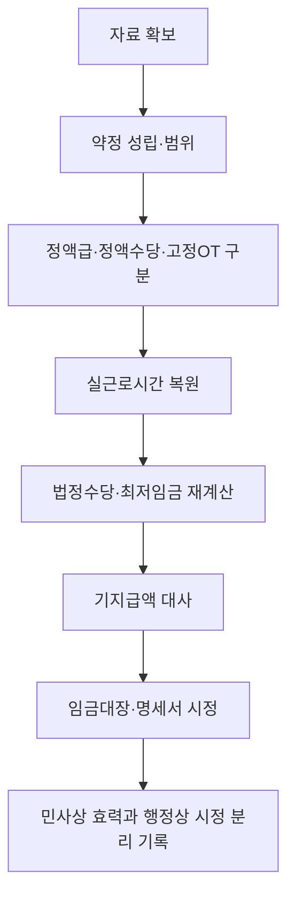

# 포괄임금·고정OT 판단·정산 실무 가이드

> **적용 기준**
> 2026-07-26 현재 포괄임금 또는 고정OT가 주장되는 사건의 약정 성립, 법정수당·최저임금 재산정, 기지급액 대사와 임금기록 시정을 위한 허브다. 실제 청구·신고·감독 대응에는 해당 임금지급기의 법령, 계약 및 근태 원자료를 우선한다.

## 이 가이드의 역할

이 문서는 [[포괄임금약정 종합 판단 로드맵]]을 실제 자료와 계산표에 적용하는 진입점이다. ‘포괄임금’ 또는 ‘고정OT’라는 명칭만으로 약정의 존재·범위나 추가 지급의무를 결론내리지 않고, 성립·유형·실근로시간·법정수당·최저임금·기록을 순서대로 분리한다.

포괄임금약정의 성립은 계약 문언 하나가 아니라 임금 항목과 산식, 근로시간·근로형태, 지급 관행을 종합하여 수당을 포함하기로 한 객관적 의사합치가 있는지로 판단한다. 기본급과 법정수당이 이미 구분되어 있다면 총액 안에 모든 수당이 포함되었다는 주장을 특히 엄격하게 검토한다. ^guide-inclusive-formation

## 한눈에 보는 실무 흐름



| 지금 가진 질문 | 먼저 볼 문서 | 이 가이드에서 남길 산출물 |
|---|---|---|
| 계약서에 포괄임금 문구가 있으면 끝나는가 | [[포괄임금약정 성립 판단 규칙]] | 포함 수당·예정시간·산식별 성립 여부 |
| 명시 문구 없이 월급만 지급해 왔다 | [[묵시적 포괄임금약정 성립 판단 규칙]] | 실질적 필요와 객관적 의사합치의 각 증거 |
| 월급 총액·시간외수당·고정OT 중 무엇인가 | [[정액급제·정액수당제·고정OT 구분 규칙]] | 정액급형·정액수당형·고정OT 분류 |
| 실제 시간이 예정시간보다 많다 | [[포괄임금약정 유효성과 법정수당 차액 지급 규칙]] | 수당별 법정액·같은 목적 기지급액·차액 |
| 최저임금도 함께 점검해야 한다 | [[포괄임금 최저임금 비교대상 시급 산정 규칙]] | 비교대상 임금·환산시간·해당 연도 최저임금 비교 |
| 명세서가 총액 한 줄뿐이다 | [[포괄임금의 임금대장·명세서 및 실근로시간 정산 규칙]] | 시간·수당·계산방법이 분리된 시정안 |

## 1단계: 자료를 먼저 같은 임금지급기 단위로 묶는다

전 재직기간을 하나의 평균값으로 합치지 않는다. 계약·임금체계·최저임금액·법령이 같은 임금지급기별로 아래 자료를 묶고, 각 자료가 가리키는 날짜와 근로자를 표시한다.

- 근로계약서, 연봉·임금협정, 취업규칙, 단체협약과 변경합의
- 월별 임금대장, 임금명세서, 급여 산출표, 은행이체·회계전표
- 출퇴근, 교대·당직, 배차·운행, 진료·접속·호출 등 실제 근로시간 자료
- 기본급·정액수당·고정OT의 예정시간, 가산율과 계산식
- 소정근로시간, 유급주휴시간, 연장·야간·휴일근로의 실제 시간
- 해당 시기의 통상임금 구성항목, 최저임금, 법령 버전과 이미 지급한 수당

[[근로기준법 제58조 근로시간 계산의 특례]] 또는 [[근로기준법 제63조 적용의 제외]]를 주장한다면 승인·서면합의·업무실태 등 그 제도의 적용 자료도 별도 묶음으로 보관한다. 이는 포괄임금 문구를 대신하는 증거가 아니라, 실제 시간과 법정수당을 어떤 기준으로 계산할지를 정하는 선행 질문이다.

## 2단계: 약정의 성립과 범위를 수당별로 확정한다

명시 약정이면 계약서에 연장·야간·휴일 중 어떤 수당을, 몇 시간·어떤 산식으로 포함한다고 적었는지 확인한다. 묵시 약정이면 정액 지급의 관행만으로는 부족하고, 시간 산정이 어려워 정액 방식을 쓸 실질적 필요와 추가 법정수당을 지급하지 않기로 한 객관적 의사합치가 함께 확인되어야 한다. ^guide-inclusive-implied

| 확인 항목 | 기록할 사실 | 바로 적용할 Rule |
|---|---|---|
| 문언 | 기본급, 포함 수당, 예정시간, 금액·가산율·계산방법 | [[포괄임금약정 성립 판단 규칙]] |
| 지급 구조 | 계약서 산식, 급여 산출표, 명세서와 실제 이체액의 일치 여부 | [[포괄임금약정 성립 판단 규칙]] |
| 시간 산정 | 근태·업무기록의 존재, 업무의 규칙성, 제58조·제63조 적용 자료 | [[묵시적 포괄임금약정 성립 판단 규칙]] |
| 협상·관행 | 협상자료, 동종 근로자 적용, 사후 일방 표시 여부 | [[묵시적 포괄임금약정 성립 판단 규칙]] |
| 범위 | 연장·야간·휴일수당별 포함·제외와 예정시간 | [[포괄임금약정 성립 판단 규칙]] |

성립, 유효성, 특정 임금지급기의 법정수당 미달은 서로 다른 질문이다. 약정이 성립하지 않으면 일반 임금체계로 법정수당을 계산하고, 성립하더라도 후속 단계에서 유효성·미달·최저임금을 각각 확인한다.

## 3단계: 명칭이 아니라 산식으로 정액급·정액수당·고정OT를 구분한다

| 구분 | 자료에서 찾을 구조 | 다음 계산 |
|---|---|---|
| 정액급형 | 기본임금과 법정수당을 나누지 않은 월급·일당 총액 | 총액에서 법정수당 부분을 역산하고 최저임금 비교대상 임금을 분리 |
| 정액수당형 | 기본임금은 있으나 하나 또는 여러 법정수당을 정액으로 포괄 | 수당별 약정액과 실제 법정액을 비교 |
| 고정OT | 수당별 예정시간·금액이 있고 실제 초과분을 정산하는 구조 | 예정시간과 실제시간을 수당별로 대조 |

계약서의 표제나 급여코드보다 기본임금 분리 여부, 수당별 예정시간·금액, 실제 초과분의 정산 관행을 우선한다. 고정OT라고 적혀 있어도 초과분을 계속 정산하지 않았다면, 고정OT의 계산·기록 구조와 맞는지 다시 확인한다. 자세한 분류와 산식은 [[정액급제·정액수당제·고정OT 구분 규칙]]을 사용한다.

## 4단계: 실제 근로시간을 복원한다

예정표의 시간만으로 계산하지 말고, 출퇴근기록·업무시스템·교대·당직·진료·운행·호출기록을 날짜별로 대조하여 실제 시간을 복원한다. 연장·야간·휴일근로는 겹치는 시간을 표시해 각 가산요건을 검토할 수 있게 한다.

| 시간 구분 | 우선 증빙 | 계산표에 남길 값 |
|---|---|---|
| 소정근로 | 계약, 교대표, 휴게·유급주휴 자료 | 일·주·월 소정근로시간 |
| 연장근로 | 출퇴근, 접속, 업무·진료·운행기록 | 실제 연장시간과 고정OT 예정시간 |
| 야간근로 | 시각별 기록, 교대·당직표 | 야간 구간의 실제 시간 |
| 휴일근로 | 휴일대장, 근무지시, 교대표 | 휴일 구분과 시간대별 실제 시간 |

실근로시간을 산정할 수 있고 급여가 소정근로의 대가로 특정되어 있다면, 월급제·교육적 성격·장기간 수령만으로 묵시적 포괄임금약정을 쉽게 인정할 수 없다. [[대법원 2025. 9. 11. 선고 2019다273803 판결]]과 [[전공의 근무시간표와 묵시적 포괄임금약정]]은 근무표와 업무기록을 같은 방향의 증거로 다룰 때의 바로가기다.

## 5단계: 법정수당과 최저임금을 따로 재계산한다

먼저 해당 임금지급기의 통상시급과 실제 연장·야간·휴일시간으로 [[근로기준법 제56조 연장 야간 및 휴일 근로]]상 수당별 법정액을 계산한다. 다음으로 포괄임금의 성립·유효성과 별도로 최저임금 산입·제외 범위와 환산시간을 적용해 최저임금 충족 여부를 점검한다.

포괄임금 총액을 최저임금과 바로 비교하지 않는다. 정액수당형은 기본급 등 산입 임금을 직접 환산하고, 정액급형은 총액에서 법정수당 부분을 역산·제외한 비교대상 임금을 산정한 뒤, 해당 임금지급기의 최저임금법상 시간으로 나눈다. ^guide-inclusive-minimum-wage

| 계산 묶음 | 확정할 입력값 | 재계산이 필요한 경우 |
|---|---|---|
| 법정수당 | 통상시급, 실제 연장·야간·휴일시간, 해당 가산율 | 실제시간·통상임금 구성·가산율이 달라짐 |
| 최저임금 | 임금구조 유형, 산입·제외 임금, 환산시간, 해당 연도 최저임금 | 정액급의 역산, 법령·최저임금액 또는 근로시간 구조가 달라짐 |
| 연쇄 검산 | 최저임금 보충 후 통상임금 산정기초 변화 여부 | 보정된 통상시급이 수당별 법정액을 바꿈 |

2020다300299 판결의 2018년 사건 수치나 구법상 분모를 현재 임금에 그대로 사용하지 않는다. [[포괄임금 최저임금 비교대상 시급 산정 규칙]]과 [[2026년 적용 최저임금 규칙]]으로 해당 지급기의 산입범위·환산시간·최저임금액을 다시 확정한다.

## 6단계: 같은 지급 목적의 기지급액만 대사한다

약정이 성립했더라도 실제 근로시간에 따른 법정수당보다 약정액이 적은 부분은 차액 정산 대상이 된다. 기지급액은 명칭만으로 모든 수당에서 빼지 않고, 같은 임금지급기·같은 수당·같은 지급 목적이 확인되는 범위에서만 대사한다. ^guide-inclusive-settlement

```text
수당별 차액
= max(실제시간과 통상시급으로 계산한 수당별 법정액
      - 같은 지급 목적의 기지급액, 0)

최종 지급차액
= 수당별 차액의 합계
  + 중복되지 않는 최저임금 보충액
```

| 대사 항목 | 반드시 분리할 값 | 흔한 오류 |
|---|---|---|
| 연장수당 | 실제 연장시간, 연장 목적 고정OT, 법정액 | 연장 명목액을 야간·휴일수당에도 일괄 공제 |
| 야간수당 | 야간 중첩시간, 야간 가산분, 기지급 야간수당 | 연장시간에 야간가산을 묻어 계산 |
| 휴일수당 | 휴일 시간대, 적용 가산율, 대응 지급액 | 휴일근로의 시간대별 가산을 생략 |
| 최저임금 | 보충액, 통상시급 재산정 여부, 재계산 수당 | 미달액만 더하고 연쇄 차액을 누락 |

## 7단계: 임금대장·명세서와 현재 임금구조를 시정한다

임금대장에는 근로시간과 연장·야간·휴일근로 시간, 항목별 금액을 남기고, 임금명세서에는 구성항목·계산방법과 시간에 따라 달라지는 계산근거를 표시한다. 정액 지급을 했다는 사정만으로 실근로시간 기록이나 차액 정산을 생략할 수 없다. ^guide-inclusive-recording

| 문서 | 지급기마다 확인할 항목 | 시정 산출물 |
|---|---|---|
| 근로계약·임금협정 | 기본급, 포함 수당, 예정시간, 가산율, 초과분 처리 | 모호한 총액 문구의 분리·명확화안 |
| 임금대장 | 실제 근로일수·근로시간, 수당별 시간·금액 | 근태와 일치하는 계산기초 |
| 임금명세서 | 구성항목별 금액, 계산방법, 공제 | 근로자가 차액을 재현할 수 있는 명세 |
| 월별 대사표 | 법정액, 기지급액, 차액, 지급·정정일 | 체불·정산·회계 반영 내역 |

## 민사상 약정 효력과 2026년 행정지도·감독 기록을 분리한다

2026년 고용노동부 지침은 기본급과 수당을 구분하고, 실제 근로시간 기록과 고정OT 초과분 정산을 감독상 점검 기준으로 제시한다. 이는 과거 약정의 민사상 성립·효력을 판례 기준으로 심사하는 것과 적용 장면이 다르므로, 아래 두 열을 하나의 결론으로 합치지 않는다. ^guide-inclusive-administration

| 판단 쟁점 | 민사상 약정 효력 기록 | 2026년 행정지도·감독 기록 | 다음 조치 |
|---|---|---|---|
| 약정의 존재·범위 | 성립·불성립, 포함 수당, 예정시간·산식과 증거 | 계약서·임금명세서에서 기본급·수당·시간이 구분되는지 | 부족 문언·산식과 근태자료 보완 |
| 법정수당 미달 | 유효·일부 무효·차액 및 수당별 기지급액 대사 | 실제시간과 약정시간의 차액이 지급되었는지 | 임금지급기별 차액 정산·지급 |
| 현재 임금구조 | 과거 지급기의 민사상 결론과 청구 범위 | 정액급·정액수당 구조를 기본급·수당별로 구분 산정하는지 | 계약·대장·명세서·급여코드 시정 |
| 기록의 완결성 | 성립·시간·기지급액을 입증할 자료의 보존 여부 | 근로시간·수당시간·계산방법 기재와 명세서 교부 여부 | 월별 대사표와 정정 이력 보관 |

## 사실유형·판례 바로가기

| 출발 사실유형 | 직접 비교할 판례 | 먼저 적용할 문서 | 이 가이드에서 만들 결론 |
|---|---|---|---|
| [[기본급과 법정수당이 구분되지 않은 정액급제]] | [[대법원 2009. 12. 10. 선고 2008다57852 판결]], [[대법원 2024. 12. 26. 선고 2020다300299 판결]] | [[포괄임금약정 성립 판단 규칙]], [[정액급제·정액수당제·고정OT 구분 규칙]], [[포괄임금 최저임금 비교대상 시급 산정 규칙]] | 성립·정액급형 여부와 최저임금 비교대상 임금 |
| [[실근로시간보다 적은 고정OT 지급]] | [[대법원 2010. 5. 13. 선고 2008다6052 판결]] | [[포괄임금약정 유효성과 법정수당 차액 지급 규칙]], [[포괄임금의 임금대장·명세서 및 실근로시간 정산 규칙]] | 실제시간 기준 수당별 차액·기지급액 대사·명세서 시정 |
| [[전공의 근무시간표와 묵시적 포괄임금약정]] | [[대법원 2016. 10. 13. 선고 2016도1060 판결]], [[대법원 2025. 9. 11. 선고 2019다273803 판결]] | [[묵시적 포괄임금약정 성립 판단 규칙]] | 실질적 필요·객관적 의사합치와 근무기록의 증명력 |

## 월별 판정·정산기록 최소 양식

```text
대상 근로자 / 임금지급기 / 적용 법령 기준일:
근로계약·임금협정 버전:

1. 약정 성립·범위
  - 명시·묵시 여부:
  - 포함 수당 / 예정시간 / 산식:
  - 성립을 뒷받침·부정하는 증거:

2. 임금구조와 실제시간
  - 정액급형 / 정액수당형 / 고정OT:
  - 소정·연장·야간·휴일 실제시간:
  - 제58조·제63조 적용 자료:

3. 재계산·대사
  - 통상시급 / 수당별 법정액:
  - 최저임금 비교대상 임금·환산시간:
  - 같은 목적 기지급액 / 수당별 차액:
  - 최저임금 보충액 / 연쇄 재계산 차액:

4. 결과 분리 기록
  - 민사상 성립·효력·금전 결과:
  - 행정지도·감독상 시정 사항:
  - 임금대장·명세서·급여·회계 정정일:
  - 검토자 / 검토일 / 다음 재검토 트리거:
```

## 흔한 오류와 교정

| 오류 | 왜 잘못되는가 | 교정 |
|---|---|---|
| 계약서에 ‘포괄임금’ 문구가 있어 곧바로 종결 | 성립 범위·유효성·실제 차액은 별도 질문 | 수당·시간·산식과 지급 실무를 수당별로 확인 |
| 약정 연장시간을 실제 근로시간으로 처리 | 고정OT는 실제시간을 간주하는 제도가 아님 | 근태·업무자료로 실제시간을 복원 |
| 월급 총액을 바로 최저임금과 비교 | 정액급 총액에는 산입 제외 법정수당이 섞일 수 있음 | 유형 분류 후 비교대상 임금과 환산시간을 재산정 |
| 시간외수당 한 항목을 모든 수당에서 공제 | 지급 목적과 수당 종류가 다를 수 있음 | 같은 지급기·같은 목적의 금액만 대응 |
| 민사상 유효와 행정상 적정을 하나로 판정 | 판례의 계약 효력 판단과 지침의 시정 기준은 효과가 다름 | 두 결과열과 후속 조치를 분리 기록 |

## 검토 한계와 변경 감시

- 이 Guide는 [[포괄임금약정 종합 판단 로드맵]]의 순서를 적용하는 문서이며, 개별 사건의 법정수당·최저임금 금액을 대신 산정하지 않는다.
- 2018년 임금에 관한 2020다300299 판결의 역사적 산식과 2019년 이후의 현행 최저임금 환산 규정을 구분한다.
- [[근로기준법 제58조 근로시간 계산의 특례]]와 [[근로기준법 제63조 적용의 제외]]는 적용 요건과 남는 임금·기록 의무를 별도로 확인한다.
- 고용노동부 지침, 근로감독 실무, 근로계약·근태·급여 산식이 바뀌면 이 Guide와 연결 Rule을 함께 재검토한다.
