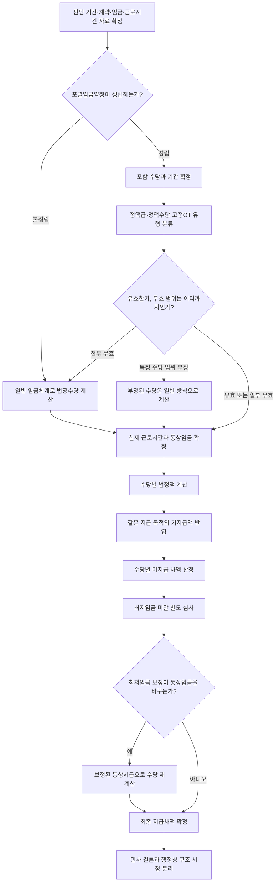

# 포괄임금약정 종합 판단 로드맵

## Issue

포괄임금약정이 주장되는 사건에서 약정의 성립 여부부터 유효성·무효 범위, 실제 지급해야 할 법정수당과 최저임금 차액까지 어떤 순서로 판단할 것인가.

## Rule

포괄임금 사건은 `성립 → 포함 범위 → 유형 → 유효성·무효 범위 → 실제 근로시간과 통상임금 → 수당별 법정액 → 동일 목적 기지급액 → 최저임금 → 재계산 → 최종 차액` 순서로 판단한다. 약정이 성립하지 않은 경우에는 유효성을 묻지 않고 일반 임금체계로 법정수당을 계산한다. ^claim-rule-inclusive-roadmap-sequence

## 전체 판단 흐름



## 0단계 — 판단 단위와 적용 법령 확정

먼저 근로자, 임금지급기와 청구기간을 확정한다. 전 재직기간을 하나의 평균값으로 처리하지 말고 법령·최저임금·임금체계가 같은 기간별로 나눈다.

확보할 자료는 다음과 같다.

- 근로계약서, 취업규칙, 단체협약과 임금협정
- 임금대장, 임금명세서와 급여 산출자료
- 출퇴근·배차·운행·진료·접속·호출 등 근로시간 자료
- 통상임금에 포함되는 임금항목과 각 지급조건
- 사업장 규모, [[근로기준법 제58조 근로시간 계산의 특례]] 또는 [[근로기준법 제63조 적용의 제외]] 적용자료
- 임금지급 당시의 최저임금법령과 연도별 최저임금액

제58조·제63조의 적용 여부는 포괄임금약정의 성립을 대신하지 않는다. 다만 실제 근로시간과 법정수당의 계산 범위를 정하는 선행조건이 된다.

## 1단계 — 약정의 성립과 포함 범위

첫 질문은 계약서에 ‘포괄임금’이라는 명칭이 있는지가 아니라, 어떤 법정수당을 어떤 임금에 포함하기로 합의했는지이다. 명시적 문언이 있으면 포함 수당·시간·금액·산식을 확인하고, 문언이 없으면 [[묵시적 포괄임금약정 성립 판단 규칙]]의 실질적 필요와 객관적 의사합치를 모두 심사한다. ^claim-rule-inclusive-roadmap-formation

| 판단 | 결과 | 다음 단계 |
|---|---|---|
| 약정 불성립 | 정액 지급만으로 법정수당 포함을 인정하지 않음 | 일반 임금체계로 수당 계산 |
| 일부 수당만 성립 | 확인된 수당에만 약정 적용 | 나머지 수당은 일반 방식으로 계산 |
| 포함 수당 전체가 특정됨 | 약정 범위 안에서 후속 심사 | 유형 분류로 이동 |

불성립은 무효와 다르다. 합의가 존재하지 않으면 그 합의의 유효성을 별도로 판단하지 않는다. 이미 지급된 정액금의 성질은 계약상 지급 목적을 별도로 확인한다.

## 2단계 — 임금구조의 유형 분류

약정의 성립과 범위를 확정한 뒤 [[정액급제·정액수당제·고정OT 구분 규칙]]으로 구조를 분류한다. ^claim-rule-inclusive-roadmap-type

| 유형 | 확인할 구조 | 계산상 의미 |
|---|---|---|
| 정액급형 | 기본임금과 법정수당을 나누지 않고 총액만 약정 | 총액에서 법정수당 부분을 역산 |
| 정액수당형 | 기본임금과 정액 법정수당을 별도 약정 | 기본임금과 수당별 약정액을 직접 확인 |
| 고정OT | 수당별 예정시간·금액과 실제시간 정산 구조 | 예정액과 실제 법정액을 임금지급기마다 비교 |

계약서의 항목명이 아니라 실제 산식과 지급 관행을 기준으로 한다. 계약서상 기본급을 표시했더라도 그 산식이 실제 총액과 맞지 않고 임금대장도 총액만 기록했다면 정액급형일 수 있다.

## 3단계 — 유효성 및 무효 범위

성립한 약정이 근로시간·법정수당의 강행기준에 맞는지를 별도로 판단한다. 근로형태, 근로시간 산정 가능성, 약정 내용과 임금 수준을 살피고 실제 법정수당보다 불리한 부분이 있는지 확인한다. ^claim-rule-inclusive-roadmap-validity

| 결론 유형 | 의미 | 계산 처리 |
|---|---|---|
| 전부 무효 | 무효 원인이 약정 전체의 효력에 미침 | 약정 배제 후 일반 방식으로 재계산 |
| 특정 수당 범위 부정 | 해당 수당을 포함했다는 합의가 인정되지 않음 | 해당 수당 전액을 별도 계산 |
| 미달 부분 무효 | 약정액이 강행기준보다 적음 | 법정액과의 차액 지급 |
| 유효하지만 실제시간 초과 | 고정OT 등 예정액보다 실제 법정액이 큼 | 초과 차액 지급 |
| 유효하고 미달 없음 | 민사상 추가 차액이 없음 | 기록·행정 시정은 별도 판단 |

법정수당 미달은 약정 전체를 언제나 무효로 만드는 것이 아니라 원칙적으로 강행규정에 미달하는 부분의 효력 문제이다. 약정 불성립, 전부 무효와 일부 무효를 같은 결론으로 표시하지 않는다.

## 4단계 — 실제 근로시간과 통상임금 확정

근로시간은 연장·야간·휴일근로로 나누고 서로 겹치는 시간을 표시한다. 예정표만 보지 않고 실제 출퇴근·업무·호출 자료를 대조한다. 통상임금은 임금지급기별 구성항목과 지급조건에 따라 확정한다.

이 단계의 산출물은 다음 네 값이다.

1. 통상시급
2. 실제 연장근로시간
3. 실제 야간근로시간
4. 실제 휴일근로시간과 적용 가산율

## 5단계 — 수당별 법정액 계산

각 임금지급기에 적용되는 [[근로기준법 제56조 연장 야간 및 휴일 근로]]의 지급률로 수당별 법정액을 계산한다. 연장근로와 야간근로 등이 겹치면 각 가산부분을 구별한다. ^claim-rule-inclusive-roadmap-allowance

```text
수당별 법정액
= 통상시급 × 해당 수당의 계산시간 × 적용 지급률
```

정액급형은 총액에서 법정수당 부분을 역산해야 하고, 정액수당형은 항목별 약정액을, 고정OT는 예정시간분 약정액을 확인한다. 유형별 상세 산식은 연결 Rule을 사용한다.

## 6단계 — 동일 지급 목적의 기지급액과 수당 차액

기지급액은 명칭만으로 일괄 공제하지 않는다. 같은 임금지급기, 같은 수당 종류와 같은 지급 목적이 확인되는 금액만 대응되는 법정수당에 반영한다.

```text
수당별 1차 차액
= max(수당별 법정액 - 같은 지급 목적의 기지급액, 0)
```

연장수당 명목의 금액을 야간·휴일수당 전체에서 공제하거나, 지급 목적이 불명확한 금액을 곧바로 기본급 또는 반환대상으로 처리하지 않는다. 고정OT의 실제 법정액이 약정액보다 작더라도 약정한 고정액은 지급한다.

## 7단계 — 최저임금 미달 별도 심사

포괄임금약정이 성립하고 법정수당 차액이 없더라도 최저임금 미달 여부는 독립하여 심사한다. 정액급형은 총액에서 법정수당 부분을 역산·제외하고, 정액수당형은 기본급 등 최저임금 산입 임금을 직접 확인한다. ^claim-rule-inclusive-roadmap-minimum-wage

현행 월급은 [[최저임금법 시행령 제5조 최저임금의 적용을 위한 임금의 환산]]에 따라 유급주휴시간을 포함한 1개월의 최저임금 적용기준 시간 수로 환산한다. 2020다300299 판결에서 사용한 월 174시간은 2018년 구법상 사건 수치이므로 현행 계산에 그대로 사용하지 않는다.

## 8단계 — 최저임금 보정과 법정수당 재계산

최저임금 미달 부분이 법정 최저임금으로 보충되어 통상임금 산정기초가 달라지는 경우에는 보정된 통상시급으로 법정수당을 다시 계산한다. 최저임금 차액을 더하는 데서 끝내면 연장·야간·휴일수당의 연쇄 차액을 빠뜨릴 수 있다. ^claim-rule-inclusive-roadmap-recalculation

재계산 뒤에는 다음 항목이 중복되지 않았는지 확인한다.

- 최저임금 미달액과 기본임금 보충액
- 보정 전·후 통상시급 차이로 늘어난 법정수당
- 같은 법정수당에 대응하는 기지급 정액수당

## 9단계 — 최종 지급차액 확정

최종 지급액은 임금지급기·수당별 표로 확정한다. ^claim-rule-inclusive-roadmap-final

| 임금지급기 | 항목 | 재산정 법정액 | 동일 목적 기지급액 | 미지급액 |
|---|---|---:|---:|---:|
| 해당 월 | 연장근로수당 |  |  |  |
| 해당 월 | 야간근로수당 |  |  |  |
| 해당 월 | 휴일근로수당 |  |  |  |
| 해당 월 | 최저임금 보충액 |  |  |  |
|  | 합계 |  |  |  |

```text
최종 지급차액
= 재계산을 마친 수당별 미지급액 합계
  + 중복되지 않는 최저임금 보충액
```

소멸시효, 지연손해금, 세금·사회보험 정산은 원금 산정 뒤 별도 단계에서 검토한다.

## 10단계 — 민사상 결론과 행정상 구조 시정 분리

과거 약정의 사법상 성립·효력과 현재 임금구조의 행정상 적정성을 한 결론으로 합치지 않는다. 2026년 고용노동부 지침에 따라 기본급과 수당별 금액·시간·산식을 구분하고, 실제 근로시간과 고정OT 예정시간을 비교하여 임금대장·명세서에 반영한다. ^claim-rule-inclusive-roadmap-administration

| 판단축 | 최종 기록 |
|---|---|
| 민사상 성립 | 성립·불성립 및 포함 수당 |
| 민사상 효력 | 유효·전부 무효·일부 무효 및 이유 |
| 금전 결과 | 임금지급기·수당별 차액과 최저임금 보충액 |
| 행정상 시정 | 기본급·수당 구분, 실제시간 기록, 명세서·대장 정정 |

## Authority

- [[대법원 2010. 5. 13. 선고 2008다6052 판결]]
- [[대법원 2016. 10. 13. 선고 2016도1060 판결]]
- [[대법원 2024. 12. 26. 선고 2020다300299 판결]]
- [[대법원 2025. 9. 11. 선고 2019다273803 판결]]
- [[근로기준법 제56조 연장 야간 및 휴일 근로]]
- [[최저임금법 제6조 최저임금의 효력]]
- [[고용노동부 2026. 4. 9. 포괄임금 오남용 방지 지도 지침]]

## Application

- 기본급과 수당이 구분되지 않은 총액은 [[기본급과 법정수당이 구분되지 않은 정액급제]]에 적용한다.
- 예정시간보다 실제 연장근로가 많은 경우는 [[실근로시간보다 적은 고정OT 지급]]에 적용한다.
- 묵시적 합의와 근무기록이 문제 되는 경우는 [[전공의 근무시간표와 묵시적 포괄임금약정]]에 적용한다.

## Notes

이 문서는 각 세부 Rule을 대체하지 않는다. 사건의 판단 순서와 분기 결과를 통제하는 상위 절차 Rule이며, 구체적 산식·판례요건·법령 예외는 연결 문서에서 확인한다.
